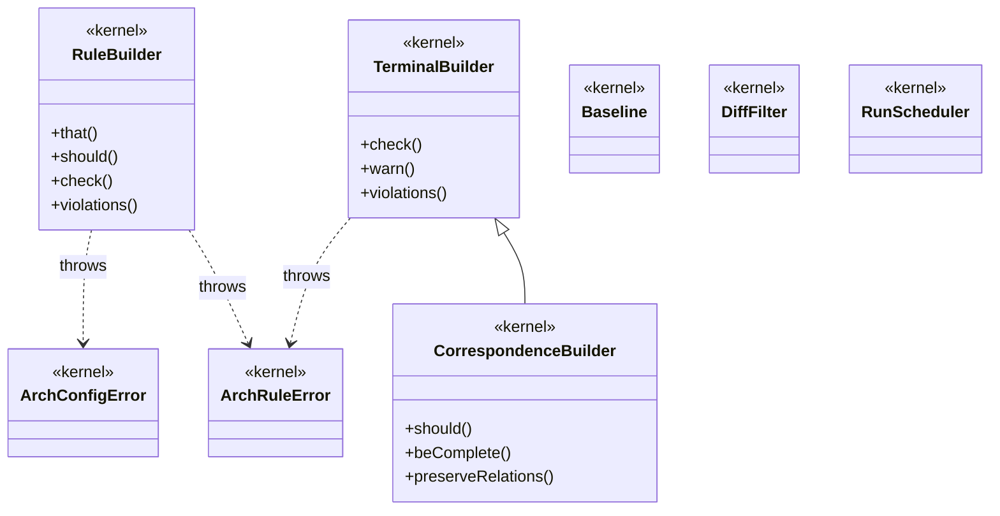

# Kernel architecture

The `@nielspeter/eess` kernel's own class diagram, embedded here as a `mermaid` fence — the `md↔mermaid` dogfood plant (plan 0096), not an adopter template. It is a hand-maintained mirror of [`docs/architecture.mmd`](https://github.com/NielsPeter/eess/blob/main/docs/architecture.mmd), which the standalone `check:diagram`/`check:crossval` gates already prove matches `packages/core`; this embedded copy is validated separately by `check:crossval`'s `md↔mermaid` gate, in both directions. There is no automated sync between the two files — a human editing one must remember the other.

## Two entry points

`@nielspeter/eess` publishes two specifiers, and the split is a decision
([ADR-011](https://github.com/NielsPeter/eess/blob/main/adr/011-the-kernels-public-api-is-explicit.md)),
not an accident of layout.

| Specifier                   | What it is                                                                                                                                               |
| --------------------------- | -------------------------------------------------------------------------------------------------------------------------------------------------------- |
| `@nielspeter/eess`          | Public API. Documented, and a change to it is a versioned change.                                                                                        |
| `@nielspeter/eess/internal` | Family plumbing the dialects share — cache registries, stderr guards, suppression and coverage counters, identity hashing, glob-tree internals. Not API. |

Everything on the diagram above is on the root. `/internal` holds the machinery
underneath it.

**You want the root.** `/internal` exists because npm has no way to ship a
package-private module: the five dialects have to share one engine, and without a
second entry point every helper they touch became a public commitment — which is
how the kernel ended up with 156 root exports, most of them undocumented and none
of them anything a rule author would name.

Nothing behind `/internal` is documented, and it changes without a migration note.
Breaking it is still a versioned change with a changeset — what you are not owed is
guidance on how to follow it.

Two consequences worth knowing before you reach for it:

- **No dialect re-exports it.** If you install only `@nielspeter/eess-ts`, reaching
  `/internal` means adding `@nielspeter/eess` to your own dependencies. It may appear
  to work without that under npm's hoisting and will not under pnpm's isolated layout
  or Yarn PnP.
- **Nothing prevents you importing it.** A subpath export is published and resolvable
  by anyone; no mechanism in npm, TypeScript or this repo can stop it. The name is the
  whole signal, which ADR-011's enforcement table records as `manual` rather than
  claiming otherwise.

If you are writing a dialect rather than consuming one, that calculus is different —
see the [kernel README](https://www.npmjs.com/package/@nielspeter/eess).
