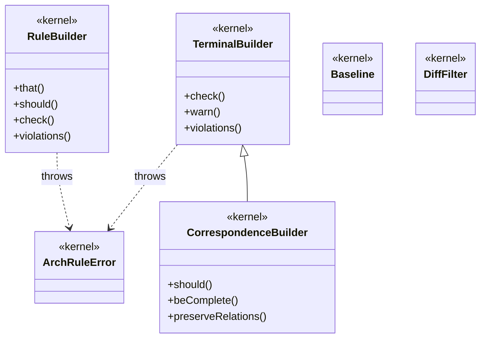

# Kernel architecture

The `@nielspeter/eess` kernel's own class diagram, embedded here as a `mermaid` fence — the `md↔mermaid` dogfood plant (plan 0096), not an adopter template. It is a hand-maintained mirror of [`docs/architecture.mmd`](https://github.com/NielsPeter/eess/blob/main/docs/architecture.mmd), which the standalone `check:diagram`/`check:crossval` gates already prove matches `packages/core`; this embedded copy is validated separately by `check:crossval`'s `md↔mermaid` gate, in both directions. There is no automated sync between the two files — a human editing one must remember the other.

