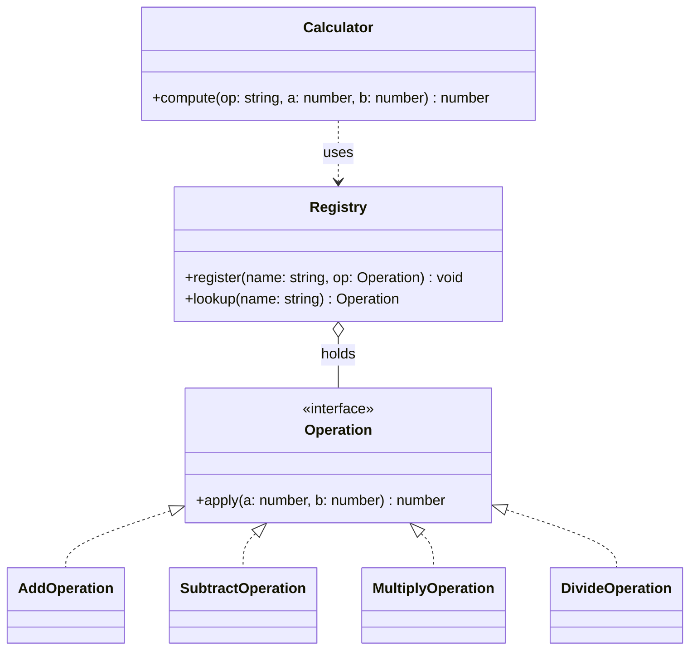

# EESS Walkthrough — Calculator

A deliberately small example. The point is the _process_, not the calculator.

---

## Stage 0 — Empty directory

```
$ mkdir calc && cd calc
$ git init
$ npx claude .
```

Nothing exists yet. No spec, no code, no validator running. That's the starting state for most projects — even ones that already have code, because the spec doesn't exist yet (see "Adopting EESS On Existing Code").

---

## Stage 1 — First conversation

> **User:** I want to build a calculator. Basic four-function. But I want to be able to add scientific and programmer modes later.

> **AI:** That implies a pluggable operation model. Want me to capture that as a vision doc first, before we talk about implementation?

> **User:** Yes.

The agent writes `docs/vision.md`:

```md
# Calculator — Vision

A four-function calculator (add, subtract, multiply, divide).

Designed for extension: scientific operations and programmer mode
(hex/binary) will be added later without rewriting the core.

Operations are pluggable. The core does not know about specific
operations; it dispatches through a registry.

## Out of scope (v1)

- Memory functions (M+, M-, MR)
- Expression parsing (1 + 2 \* 3); v1 takes operands one at a time
- Persistence
```

**What's testable now:** nothing yet. Vision doc is prose. But the structure is in place.

---

## Stage 2 — First decision becomes an ADR

> **User:** OK. We need to decide how operations are registered.

> **AI:** Three obvious models: hardcoded list, decorator/annotation registration, manual register() calls. Want me to write up the tradeoffs as an ADR?

> **User:** Yes. Recommend one.

The agent writes `docs/adr/0001-operation-registry.md`:

```md
# ADR-0001 — Operation Registry

## Status

accepted

## Context

The core dispatches arithmetic to operation implementations. We need a
mechanism for operations to register themselves so the core remains
unaware of specific operations.

## Decision

Operations register themselves at module-load time via a manual
`registry.register()` call. No decorators, no auto-discovery.

## Consequences

- Adding an operation requires importing it somewhere (e.g., a barrel)
  so its registration runs.
- Operations are pure functions of (a, b) → number plus a name string.
- The core (`src/core/**`) does not import from `src/operations/**`.

## Enforcement

- `src/core/**` may not import from `src/operations/**`
- every file in `src/operations/**` must call `registry.register()`
- operation classes/functions implement the `Operation` interface
```

**The `## Enforcement` section is what makes this an _executable_ ADR.** It compiles to architecture rules.

The agent generates `arch.rules.ts`:

```typescript
import { project, modules, functions, classes } from '@nielspeter/eess-ts'
import { call } from '@nielspeter/eess-ts/helpers'

const p = project('tsconfig.json')

// ADR-0001
modules(p)
  .that()
  .resideInFolder('src/core/**')
  .should()
  .notDependOn('src/operations/**')
  .rule({ id: 'adr-0001/core-doesnt-import-operations' })
  .check()

modules(p)
  .that()
  .resideInFolder('src/operations/**')
  .should()
  .contain(call('registry.register'))
  .rule({ id: 'adr-0001/operations-self-register' })
  .check()
```

**What's testable now:** the ADR's enforcement claims. Currently vacuous — there's no code yet. But `npm run arch` runs cleanly and the rules are in place.

---

## Stage 3 — Diagram emerges

> **AI:** Want me to sketch the structure as a Mermaid class diagram before we write code?

> **User:** Yes.

The agent writes `docs/architecture.mmd`:



**What's testable now:** eess-mermaid (merged) validates the diagram is internally consistent. Cross-validation will fire once the code exists.

---

## Stage 4 — Tech stack decision

> **User:** Let's use TypeScript and a small React UI.

> **AI:** I'll write that as ADR-0002 — locks the choice.

`docs/adr/0002-stack.md`:

```md
# ADR-0002 — Stack

## Status

accepted

## Decision

- Language: TypeScript (strict mode)
- UI: React with Vite
- Test runner: Vitest
- Build: tsc + Vite
- Architecture validator: eess-ts

## Enforcement

- no file in src/\*\* imports from devDependencies
- no file in src/core/\*\* imports from React
- all .ts files use strict mode (tsconfig.json)
```

The agent updates `tsconfig.json`, `package.json`, generates `vite.config.ts`. It also extends `arch.rules.ts` with the new enforcement rules.

**What's testable now:** the stack rules. `npm run arch` runs them.

---

## Stage 5 — First implementation

The agent writes:

```
src/
  core/
    calculator.ts
    registry.ts
    operation.ts          # interface
  operations/
    add.ts
    subtract.ts
    multiply.ts
    divide.ts
    index.ts              # barrel — imports register all four
  ui/
    App.tsx
```

`npm run arch`:

```
✓ adr-0001/core-doesnt-import-operations
✓ adr-0001/operations-self-register
✓ adr-0002/no-react-in-core
✓ adr-0002/strict-mode
```

**What's testable now:** the ADRs' enforcement claims, against real code. The previously vacuous rules now have substance.

---

## Stage 6 — Cross-validation activates

`diagramMatchesCode(diagram('docs/architecture.mmd'), project('tsconfig.json'))`
runs — the Mermaid↔TS preset from `@nielspeter/eess-crossvalidate/mermaid-ts`,
built on the kernel `correspondence()` primitive:

```
✓ every diagram class has a matching TS class (and vice versa)
✓ Calculator -> Registry edge matches Calculator imports Registry
✓ Registry -> Operation edge matches Registry holds Operation[]
✓ AddOperation realizes Operation matches class AddOperation implements Operation
```

**The diagram and code are now bound.** Either side drifts → fails.

---

## Stage 7 — Drift caught

> **User:** Add a modulo operation.

The agent writes `src/operations/modulo.ts` and adds it to the barrel. It does not update the diagram.

`npm run arch`:

```
✗ crossval/diagram-completeness:
  TS class "ModuloOperation" has no matching diagram class in docs/architecture.mmd

  Either:
    - add `class ModuloOperation` and `Operation <|.. ModuloOperation` to
      docs/architecture.mmd
    - or remove src/operations/modulo.ts
```

The agent updates the diagram. Re-runs. Passes.

**This is the property the system is for.** The agent forgot. The validator caught it. The build can't merge until both sides agree.

---

## Stage 8 — Diff mode in action

> **User:** I want to add scientific operations (sin, cos, sqrt) as an optional module loaded by feature flag.

> **AI** (running validator in diff mode): Before I write code, here's what this change touches:

```
Proposed change: add scientific operations under feature flag
Affected artifacts:
  - docs/adr/0003-scientific-module.md (new)         — decision record
  - docs/architecture.mmd                             — add ScientificRegistry, sin/cos/sqrt classes
  - arch.rules.ts                                    — gate src/operations/scientific/** behind flag
  - src/operations/scientific/* (new)                 — implementations
  - src/core/calculator.ts                           — feature-flag check
  - tests/scientific.test.ts (new)                   — coverage

Conflicts to resolve:
  - ADR-0001 currently says "operations register at module load"
    Scientific module won't load without flag — does ADR-0001 still
    hold for scientific operations, or do we need an addendum?
```

> **User:** Good catch. Add an addendum to ADR-0001 saying conditional modules are allowed if the condition is documented.

The agent now has a scoped, concrete plan. Same validator engine — different invocation.

---

## Stage 9 — What's accumulated

After 9 stages of conversation:

```
calc/
├── docs/
│   ├── vision.md
│   ├── architecture.mmd
│   └── adr/
│       ├── 0001-operation-registry.md
│       ├── 0002-stack.md
│       └── 0003-scientific-module.md
├── arch.rules.ts                ← derived from ADR enforcement sections
├── arch-baseline.json
├── src/
│   ├── core/
│   ├── operations/
│   └── ui/
└── package.json
```

The team can answer:

| Question                                                | Where to look                               |
| ------------------------------------------------------- | ------------------------------------------- |
| "Why does the core not import operations?"              | ADR-0001 — Decision + Why                   |
| "Where is the system shape documented?"                 | architecture.mmd — renders in any MD viewer |
| "What stops someone from adding a new operation wrong?" | arch.rules.ts — fails the build             |
| "What's the system supposed to do?"                     | vision.md                                   |
| "Did we already think about feature X?"                 | grep ADRs                                   |

**The validator is running on every PR from stage 2 onward.** No big-bang spec authoring; the spec accumulates one ADR at a time as decisions are made.

---

## What this example shows

1. **EESS is incremental.** Stage 1 has 3 lines of vision; stage 9 has a complete validated system. Nothing was designed up front.
2. **Every artifact is executable from the moment it's added.** The ADR's `## Enforcement` section compiles to rules. The diagram compiles to cross-checks. Even at stage 2 with no code, the rules are running (vacuously).
3. **Drift is caught the moment it happens** (stage 7), not in code review three days later.
4. **Diff mode scopes change** (stage 8) — the AI doesn't have to guess what else to update.
5. **Institutional memory is in git** — closed conversations don't matter, the ADRs and diagram do.
6. **Both sides are equal.** The agent is fast and unreliable. The validator is slow and reliable. Together they're fast and reliable.

The calculator is trivial. The process scales.
