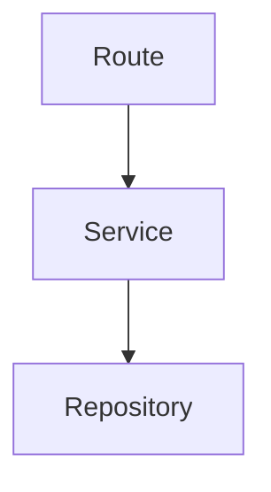

# The eess manifesto

> **New to eess?** This is the full design spec — dense by design. For a
> five-minute plain-language intro, start with [What is eess?](/what-is-eess).

_On the name: **eess** originated as an acronym — Executable Enforceable
Specification System — the founding idea recorded below. Today it is just the
name; nothing about using eess requires adopting a "specification system"._

## Core Thesis

Modern software systems suffer from semantic drift.

Business intent, architectural decisions, workflows, constraints, and operational rules gradually disappear into implementation details:

- database fields
- REST handlers
- framework glue
- infrastructure workarounds
- validation scattered across services
- historical patches

Over time, the implementation becomes the only source of truth.

The central idea of an Executable Enforceable Specification System (EESS) is:

> Specifications become the authoritative semantic representation of the system.

The implementation becomes a realization artifact.

Code stops being the only truth.

Spec and code are validated against each other. Neither is privileged in isolation. The spec describes what should be. The code is what exists. The validator confirms they agree. Drift in either direction fails the build.

## Constraints, not a map

A fair critique of spec-driven frameworks: an over-specified plan forces the
builder — human or agent — down a predetermined path, and produces worse
results the moment reality diverges from the plan. The map is not the
territory.

eess takes the other side of that trade deliberately. It does **not** dictate
how work gets done — no prescribed steps, no workflow the agent must follow,
no generated task lists. It verifies **invariants on the finished work**: the
layering holds, the diagram matches the code, the ADR's clause is satisfied,
the citation resolves. How the builder gets there is the builder's business;
_that_ it got there is the build's. A high-agency agent with a fuzzy goal and
a few hard constraints outperforms one marched through a script — eess exists
to make those few constraints real.

---

# Core Principles

## 1. Specifications Are Authoritative

Specifications are not documentation.

They are:

- executable
- enforceable
- machine-readable
- AI-readable
- human-readable
- operationally authoritative

The implementation must conform to the specification.

---

## 2. Humans Declare Intent

Humans are best at:

- goals
- business semantics
- tradeoffs
- governance
- architecture reasoning

Example:

```text
Allow guest checkout.
```

---

## 3. AI Formalizes Intent

LLMs expand human intent into structured semantic specifications.

The AI generates:

- workflows
- contracts
- rules
- state machines
- tests
- diagrams
- architecture changes
- enforcement rules

---

## 4. Specifications Must Be Human Readable

Specifications should feel closer to:

- Markdown
- ADRs
- workflows
- diagrams
- engineering narratives

than:

- ASTs
- compiler IR
- XML configuration systems
- theorem provers

---

## 5. Validation Is Essential

LLMs require feedback loops.

Validators provide grounding.

Exactly like:

- compilers
- type systems
- tests
- linters

But at the semantic architecture layer.

Generation and validation interleave.

The AI generates. The validator checks. This holds at every layer: spec, schema, rule, diagram, implementation. Each generation step is followed by a validation step.

Without the validator the AI is fast and unreliable. With it, the system is fast and correct.

---

# Proposed System Architecture

## Semantic Source Layer

Human-readable semantic artifacts:

- Markdown specifications
- Mermaid diagrams
- ADRs
- workflow definitions
- architecture rules
- executable tests

Example artifacts:

```text
purchase.workflow.md
payment.adr.md
checkout.test.md
architecture.mmd
```

---

## Schema Layer

Every specification type has schemas.

Schemas define:

- required sections
- semantic structure
- allowed relationships
- valid transitions
- ownership boundaries
- architectural constraints

Example:

```text
workflow schema
- must define states
- must define transitions
- terminal states required
- tests required
```

---

## Mermaid Semantic Schemas

Mermaid diagrams become semantic architecture artifacts.

Example:



Schema validation may enforce:

- Route may only connect to Service
- Repository owns persistence access
- Domain cannot depend on infrastructure

---

## Enforcement Layer

Architectural constraints become executable rules.

Examples:

- services must delegate to repositories
- route handlers must validate input
- generic Error usage forbidden
- workflows must define failure states

This layer is conceptually similar to:

- ArchUnit
- semantic linting
- compiler enforcement

This is Tier 1 — statically decidable facts about code. Not every decision is. See Enforcement Tiers.

---

## AI Integration Layer

AI agents consume:

- schemas
- architectural rules
- workflows
- ADRs
- semantic graphs
- executable constraints

The AI becomes:

- implementation synthesizer
- semantic maintainer
- architectural reasoner
- consequence analyzer

---

## Runtime / Generation Layer

The runtime realizes semantic specifications into operational systems.

In an AI-driven workflow, the realization engine is the AI itself — not a separate code-generation tool. The AI consumes validated specifications and produces:

- APIs
- database schemas
- infrastructure manifests
- UI bindings
- service implementations
- validation layers

Each output is re-grounded by the validator before it becomes authoritative.

Generated code is treated similarly to compiler output. The difference is that the "compiler" is an LLM, whose output cannot be trusted by construction. Validation closes that gap.

---

# Markdown As Semantic Medium

Markdown is an excellent foundation because it is:

- human-readable
- AI-friendly
- structured
- diffable
- Git-native
- composable

The proposal is not:

> Markdown as documentation.

But:

> Markdown as executable semantic architecture.

---

# Example Workflow Specification

```md
# Workflow: Purchase

## States

- Cart
- PendingPayment
- Completed
- Rejected

## Transitions

- Cart -> PendingPayment
- PendingPayment -> Completed
- PendingPayment -> Rejected

## Rules

- Users under 18 cannot purchase alcohol

## Tests

### Underage Purchase

Input:
user.age = 16

Expected:
Rejected
```

This specification is:

- human-readable
- machine-parseable
- schema-validatable
- AI-maintainable
- executable

---

# Enforcement Tiers

eess-ts covers exactly one category: statically decidable structural facts
about source code — imports, dependency direction, forbidden calls in bodies,
typed unions vs bare strings, naming, cycles. Its body analysis pushes that
category further than most tools. But it is one category.

ADRs routinely decide things outside it. "Payments must be idempotent" is
behavior. "PII never leaves the region" is runtime. "Error messages must be
actionable" is judgment. "We chose PostgreSQL" is a rationale nothing should check.

The honest response is not to pretend everything is archunit-checkable. It is to
classify each clause by its enforcement tier and route it to the right mechanism.

## The tiers

| Tier | Name         | What it enforces                        | Mechanism                                   | Hardness         |
| ---- | ------------ | --------------------------------------- | ------------------------------------------- | ---------------- |
| 1    | Static       | Statically decidable facts about code   | eess-ts (.ts); linter (other dialects)      | blocks           |
| 2    | Behavioral   | Claims about runtime behavior           | spec-derived / contract / property tests    | blocks           |
| 3    | Operational  | Properties of the running system        | observability, policy-as-code, infra checks | alerts or blocks |
| 4    | Semantic     | Judgments with no deterministic checker | LLM validator, with cited evidence          | flags (soft)     |
| 5    | Ratification | The choice and rationale themselves     | governance — versioned, amended by process  | persists         |

Tier 2 is where most business ADRs live, and where the gap usually is. Tier 4 is
new: honor-system-only in the human era, agent-as-reviewer makes it partially
enforceable for the first time — probabilistically, so it flags rather than blocks.
Tier 5 is not a tooling failure; it is the "why" that Tiers 1–4 cite.

## Tier is not mechanism

A tier says what kind of fact a clause is. The mechanism is what checks it — and
one tier can have several.

Tier 1 is statically decidable, but "statically decidable" is not "eess-ts can
see it." eess-ts parses TypeScript; it does not parse Vue SFC <script> blocks.
A rule about client-side code in a .vue file is still Tier 1 — but its mechanism is
the linter, not eess-ts. Declare the mechanism, not just the tier.

## Declare the tier, gate on the declaration

Every Enforcement clause carries three fields: tier, mechanism, status.

The gate fails on a MISSING declaration — not on low hardness. A Tier 5 clause
with `mechanism: governance` passes. A clause with no tier fails schema validation.

This is the load-bearing move. It converts the unchecked surface from unknown into
a queryable list. Unchecked clauses are exactly the ones an agent silently
optimizes away; forcing every clause to name its tier makes that surface visible.

Declining hardness is fine as long as it is declared: Tier 1–2 block, Tier 3
alerts or blocks, Tier 4 flags for human review, Tier 5 persists under governance.

## Status: decided is not enforced

A clause can be the right rule, correctly Tier 1, and still not gate today —
because the code does not satisfy it yet. That is a third state: `pending`.

`pending` is the honest label for "decided, mechanism known, not yet green." Same
shape as baseline mode: record the gap, don't fake the gate, ratchet it closed.
When the code catches up, status flips to `gated`. A rule that fails today is not a
broken ADR; it is a declared, tracked debt.

## Rules age — enforcement is not monotone

The honest counterpoint to "every correction becomes a permanent check": rules
can outlive their usefulness. Models stop making the mistake a guardrail was
written for; a convention becomes universal; a constraint's reason disappears
in a refactor. A rule that never fires is either a solved problem or a vacuous
check — and the two look identical from the green side. Practitioners running
agent harnesses report reviewing their rule sets at every model generation and
retiring what no longer earns its place; forgetting is part of a functioning
memory.

eess's stance: retirement is a **status transition, not a deletion** — the
existing vocabulary already carries it (`deprecated`: no longer in force, kept
for history), and the decision to retire is Tier 5, a human act, exactly like
the decision to adopt. What's planned beyond the stance: a `review-by`
discipline on enforcement rows, and telemetry-driven retirement signals —
"this rule hasn't fired in N months across all runs; retire or keep
deliberately?" — from violation-history analysis (plan 0073). Until then the
principle stands: a rule earns its place by discriminating, and a green that
can no longer fail is not enforcement.

## This is not hypothetical

A production Nuxt app applied this model to its real ADRs, and the tiers caught two
mistakes a binary enforceable/not table had made:

- "Documents are append-only" has NO gated clause today. The clean Tier 1 rule —
  no hard-delete — fails now, because the code still hard-deletes. Declared
  `pending`, shipped as a skipped rule, ratchets green when the soft-delete
  migration lands. Marking it `gated` would have been a lie.
- "List filtering is server-side" IS enforceable — but not by eess-ts, which
  can't see the .vue page where the anti-pattern lives. Its mechanism is a lint
  rule. Tier 1, different compiler.

## Detection and remediation both route by tier

The tiers answer "how is this _checked_." They answer "how is this _fixed_" too —
by the same logic. When a clause is violated, the repair routes to the mechanism
suited to it, exactly as the check does:

| Nature of the fix                                                                        | Fixed by                             |
| ---------------------------------------------------------------------------------------- | ------------------------------------ |
| Deterministic, unique (a moved link, a shortened pointer whose target resolves uniquely) | the tool — a mechanical rewrite      |
| Ambiguous (several candidates resolve)                                                   | the agent — it chooses, tool applies |
| Judgment (a spec drifted from code — which side is right?)                               | the agent — it proposes the change   |
| Policy (what should this ADR decide?)                                                    | the human — governance               |

This is the whole thesis pointed at repair. An LLM is expensive, probabilistic,
and optimized for judgment; a codemod is free, deterministic, and exact. Routing
a mechanical link-fix _through the agent_ is the category error the system exists
to prevent — spending the judgment tool on rote toil it is bad at. So the
deterministic layer owns everything deterministic on **both** sides: it detects
what it can prove, and it _fixes_ what it can prove, reserving the agent for the
ambiguity and judgment only the agent (or a human) can resolve.

Concretely: a validator that computes a violation has usually already computed
its fix. A broken link whose target resolves to exactly one file — the resolver
found that file to _report_ the break; emitting the rewrite is a byproduct, not
new work. Declining to apply it just to stay "read-only" hands rote toil back to
the expensive tool. The honest boundary is not "validators don't mutate" (linters
have `--fix`); it is "**auto-apply only what is deterministic and unambiguous; route the rest.**"

So the Enforcement table's `mechanism` column has a natural sibling —
**remediation**: `auto` · `agent` · `human`. A clause declares not only how it is
checked, but who repairs it when it breaks. Detection and remediation are the same
routing decision, made twice.

---

# Executable ADRs

Architecture Decision Records become enforceable.

```md
# ADR-012

## Decision

Services may not access repositories directly.

## Why

Prevents infrastructure leakage and preserves layering.

## Enforcement

| Clause                                                   | Tier | Mechanism               | Status |
| -------------------------------------------------------- | ---- | ----------------------- | ------ |
| Route -> Repository forbidden                            | 1    | eess-ts                 | gated  |
| Route handlers validate input before delegating          | 1    | eess-ts (body analysis) | gated  |
| Every repository call carries the request correlation id | 3    | runtime / observability | alert  |
| Chose layered repository access over direct data access  | 5    | governance              | —      |
```

---

# Feedback Loops

AI systems require validators.

Example:

```text
AI introduces guest_checkout field.
```

Validator response:

```text
Semantic violation:
- workflow state missing
- fraud rules not updated
- tests missing
- architecture constraint violated
```

The validator grounds the AI.

---

# Drift and Diff

The validator does two distinct jobs.

## Drift — reactive

Question: do current spec and current code agree?

Trigger: CI run, post-merge.

Output: pass or fail.

This is the gate. Drift in either direction fails the build — at a hardness set by the clause's tier: Tier 1–2 block, Tier 3 alerts or blocks, Tier 4 flags for review (see Enforcement Tiers).

## Diff — proactive

Question: if I make this change, what else must change?

Trigger: PR preview, AI planning, change scoping.

Output: a scoped list of artifacts that must change for the system to remain consistent.

Example:

```text
AI proposes: add priority field to Order class.

Diff validator answers:
- spec arch.mmd does not have priority on Order — update required
- handler test for POST /orders does not reference priority — update required
- ADR-014 says order fields are immutable — conflict, resolve before proceeding
```

One engine, two invocations:

- Drift: validator(current) → violations
- Diff: validator(proposed) − validator(current) → required follow-ups

---

# Consequence Analysis

Once semantic specifications exist, AI can reason globally.

Example requirement:

```text
Allow guest checkout.
```

AI may analyze consequences:

- fraud workflow affected
- payment assumptions changed
- audit requirements impacted
- tax reporting impacted
- mobile UI state changes required
- new tests needed

This becomes semantic impact analysis.

---

# Relationship To Existing Systems

This direction builds upon ideas already present in:

- Kubernetes
- Terraform
- ArchUnit
- Mermaid
- Markdown ecosystems
- ADRs
- OpenAPI
- GraphQL
- Infrastructure as Code

The difference is:

- semantic authority
- executability
- AI integration
- continuous enforcement
- architectural governance

---

# Why This Matters In The AI Era

AI accelerates implementation faster than humans can review architecture.

Without semantic governance:

- architectural entropy increases
- systems decay faster
- hidden coupling spreads

Executable enforceable specifications provide:

- grounding
- governance
- semantic continuity
- architectural preservation
- AI correction loops

---

# The Amnesiac Reader

Every agent session is a brilliant amnesiac.

It knows nothing about the project. It starts from zero, every time. But if
all knowledge lives in the repo — plans updated with what was done _and done
otherwise_, ADRs, bug records, git history — then onboarding is instant.
Nothing hidden. The repo is the agent's only memory.

This changes what documentation is. It is no longer prose beside the system.
It is the **externalized memory of a stateless intelligence** — and memory
for an amnesiac has a property ordinary documentation never needed:

> The reader has no independent basis for doubt.

A human with continuity smells staleness — "that doc feels old." The
amnesiac cannot. Every note is equally credible. Trust is binary and total.

Therefore:

> False memory is worse than no memory.

A confidently wrong agent produces damage faster than a cautiously ignorant
one. And in an agent loop, drift does not linger the way stale docs did — it
**compounds**: the spec is input to the next generation, which writes the
next spec, which is input to the one after. Photocopy of a photocopy.

This is why memory-in-git _requires_ mechanical truth enforcement in a way
human documentation never did. For a human reader, doc validation was a
nice-to-have — the reader was the fallback validator. For an amnesiac
reader, there is no fallback. The validator is the condition under which the
memory is safe to trust at all.

Memory and enforcement are two halves of one loop:

- the corpus constrains what the agent **should** do
- the gates constrain what it **can get away with**

Notes and locks. An amnesiac needs both, because it will occasionally act
against its own notes — context truncation, bad retrieval, plain model error
— and only the deterministic layer catches that. The agent's self-review
shares the failure modes of its generation.

A corollary for the corpus itself: cross-links and indexes are not
navigation sugar — they are the amnesiac's retrieval structure. A broken
link is not untidiness. It is a severed memory pathway: the note exists, but
for the next session it might as well not.

---

# The All-Agent Regime

Taken to its end state: no human touches spec or code. Humans interact only
through conversation. Agents write everything.

In that regime:

**The spec is the constitution, not the documentation.** Chat is ephemeral —
sessions end, context dies. The repo's specifications are the only durable
semantic state, and the only surface the human can govern through. The spec
is the interface between human governance and machine execution. A contract.
And a contract without enforcement is a wish.

**Deterministic validators are the only ground truth in the chain.** Human
decides in chat → agent writes spec → agent writes code → agent reviews.
Every link is probabilistic except the validators. Trust cannot rest on
reading (the human does not read) or on the agent's self-report (LLMs
confabulate confidence). It can rest only on deterministic gates and
observed behavior. The compiler, the tests, and the spec validator are the
only non-LLM links in the loop.

**The human's role is ratification.** Intent enters through chat; an agent
crystallizes it into a spec; the human ratifies the diff — in chat. That
makes Tier 5 load-bearing, not ceremonial: the decision record (the ADR) is
the crystallized chat decision, the statute the lower tiers cite. The
governance loop closes when every gated claim traces to a ratified decision
— _no claim without ratification_ — which is mechanically checkable as
provenance, even though intent itself is not.

Humans legislate in chat. Decision records are the law. Agents execute.
Deterministic validators are the court.

---

# The Consumer Principle

Spec↔code synchronization has been attempted before — UML round-tripping,
MDA, CASE tools, literate programming — and it died every time, always of
the same cause: **the spec had no consumer.** Nobody's work depended on the
diagram being true, so maintaining it was pure cost, and rational teams let
it rot.

The successes of spec↔code sync are the artifacts we stopped calling specs:
type systems, OpenAPI, infrastructure-as-code, database migrations. What
separates them: the spec is **load-bearing** — an input to machinery, not a
description beside it.

> Sync survives where the spec is consumed. It dies where it is merely
> checked.

Agents changed the equation: the spec is now consumed on every session, as
raw input to code generation. That is the regime change that makes EESS
viable where its predecessors were not — and it is conditional. The
discipline that keeps it on the right side of the graveyard:

- **Only bind what has a consumer.** Before gating any artifact, ask: who or
  what suffers when this drifts? If the answer is nothing — delete the spec,
  do not gate it.
- **Check claims, not descriptions.** Bind things with crisp identity —
  names, presence, relations, citations, table rows. A spec should say less
  and always be true, rather than say everything and drift.
- **A validator used to keep unconsumed documents true is ceremony.** The
  moment the system gates documents nobody reads, it has become UML with
  better error messages.

---

# Adopting EESS On Existing Code

Most teams do not have greenfield. They have years of code where the spec never existed, or existed once and decayed.

EESS applies to legacy systems through a third mode.

## Three Modes

| Mode       | Direction   | When                         |
| ---------- | ----------- | ---------------------------- |
| Extraction | Code → Spec | Bootstrap legacy systems     |
| Generation | Spec → Code | Greenfield, new features     |
| Validation | Spec ↔ Code | Continuous, after both exist |

Generation and validation are described above. Extraction closes the loop for teams who do not start from zero.

## Extraction

The mechanism:

1. AI reads existing code.
2. AI proposes spec artifacts — class diagrams, layer descriptions, ADRs reverse-engineered from observed structure, candidate workflow definitions.
3. Human curates. Accepts what is genuinely intentional. Rejects what is accidental. Edits what is partially right.
4. The curated spec becomes the new baseline truth.
5. Validation kicks in. Drift detection starts from this point forward.

A rule the curated spec asserts but the legacy code does not yet satisfy is not dropped — it is recorded as `pending` (see Enforcement Tiers) and ratcheted closed as the code catches up.

## What Extraction Recovers

The legacy code becomes the evidence the spec was extracted from, not the source of truth.

Going forward, the spec governs. The code conforms.

## The Curation Requirement

The AI extracts hypothesis, not fact.

Code reveals what it does. Code does not reveal what it was meant to do.

Five years of accumulated workarounds, bugs, and local constraints look identical to intentional patterns from the AI's perspective.

Human curation is the operation that separates the system from the artifacts of how we got here.

This step is not optional polish. It is the moment legacy stops being truth-by-attrition and becomes truth-by-curation.

---

# Final Vision

An Executable Enforceable Specification System is:

- human-readable
- AI-maintained
- schema-validated
- architecturally enforceable
- semantically authoritative
- operationally executable

It transforms software engineering from:

```text
implementation-centric programming
```

into:

```text
semantic system engineering
```

where:

- specifications become the source of truth
- implementation becomes realization
- AI becomes semantic maintainer
- validators preserve architectural integrity
- architecture becomes executable law
