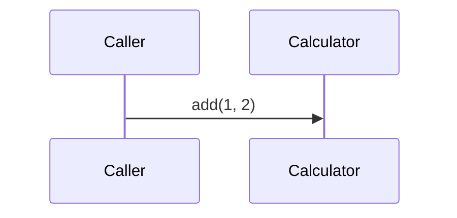
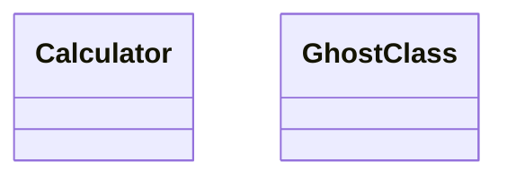

# Architecture

```mermaid
sequenceDiagram
Caller->>Calculator: add(1, 2)
```

The class shape — this one names a class that does not exist in code:

```mermaid
classDiagram
class Calculator
class GhostClass
```
