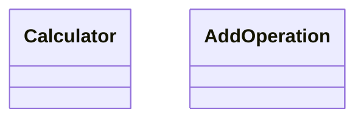
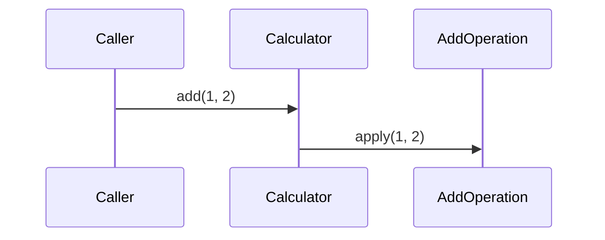

# Architecture

The core shape:

```mermaid
classDiagram
class Calculator
class AddOperation
```

And how a request flows through it — a different diagram type, in the same
document, which this binding does not model and must therefore skip:

```mermaid
sequenceDiagram
Caller->>Calculator: add(1, 2)
Calculator->>AddOperation: apply(1, 2)
```
