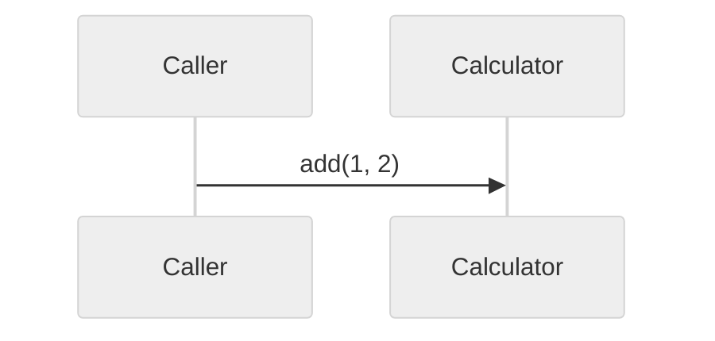

# Flow

A multi-line `%%{init}%%` block — documented Mermaid usage. Skipping only lines
that _start_ with `%%` read the continuation line as the kind.

```mermaid
%%{
  init: { 'theme': 'neutral' }
}%%
sequenceDiagram
Caller->>Calculator: add(1, 2)
```
