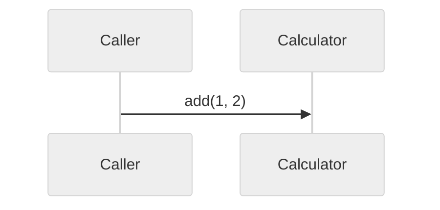
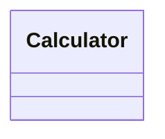

# Flow

A themed sequence diagram beside a real class diagram. The theme directive is
what makes `declaredKind()` load-bearing: without the `%%` skip the directive
line is read as the kind, the fence stops looking foreign, and it is handed to
the class-diagram parser as a false positive.

