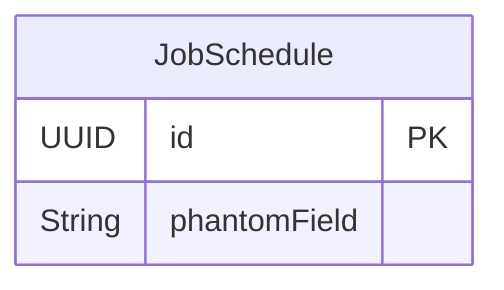

# Entity: Job Schedule

## Properties

| Property | Type | Required |
| -------- | ---- | -------- |
| id       | UUID | Yes      |

```mermaid
erDiagram
    JobSchedule {
        UUID id PK
        String phantomField
    }
```
