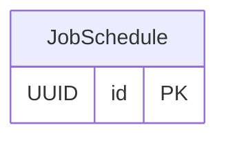

# Entity: Job Schedule

## Properties

| Property | Type   | Required |
| -------- | ------ | -------- |
| id       | String | Yes      |

```mermaid
erDiagram
    JobSchedule {
        UUID id PK
    }
```
