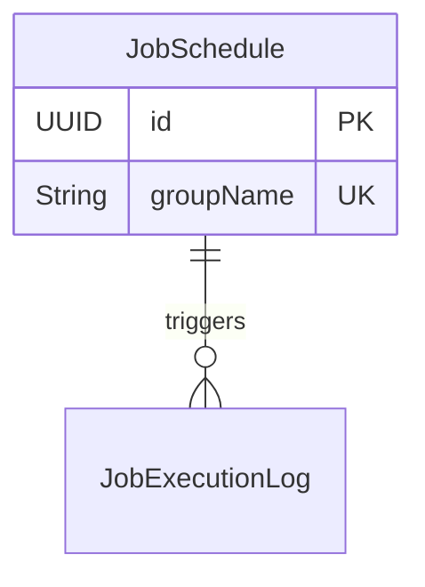

# Entity: Job Schedule

## Properties

| Property       | Type   | Required |
| -------------- | ------ | -------- |
| id             | UUID   | Yes      |
| groupName      | String | Yes      |
| cronExpression | String | No       |

## Relationships

