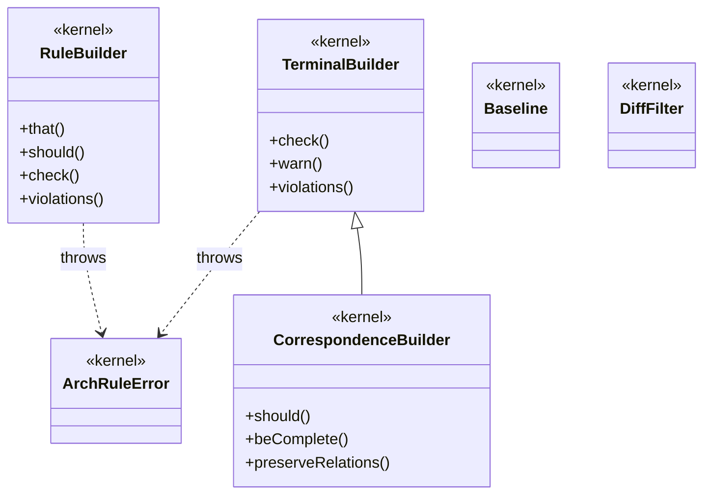

# NON-VACUITY FIXTURE

The clean-direction control for the `md↔mermaid` gate — see
`scripts/nonvacuity/bad-md-mermaid.mjs`. `docs/architecture.mmd`'s real
content, embedded verbatim, so a gate stuck permanently red cannot pass for a
working diagram either. This is a **third** hand-maintained copy of the kernel
diagram (alongside the standalone `.mmd` and `docs/architecture.md`'s embed) —
same no-automated-sync caveat applies.

