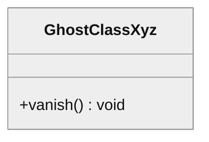

# NON-VACUITY FIXTURE

Deliberately violating input for the `md↔mermaid` gate — see
`scripts/nonvacuity/bad-md-mermaid.mjs`. Identical drift to
`drifted-diagram.md`, except the fence opens with a `%%{init}%%` theme
directive before the `classDiagram` keyword — legal Mermaid, since the grammar
treats `%%` lines as hidden terminals.

This fixture exists because the fence SELECTOR is a way to lose coverage
silently: an allowlist requiring `classDiagram` as the first line dropped this
document without a word, and every gate stayed green (bug 0209 review). The
selector needs its own break class, not only the comparison it feeds.

