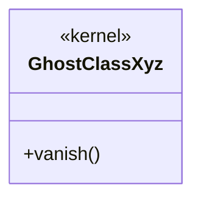

# NON-VACUITY FIXTURE

Deliberately violating input for the `md↔mermaid` gate — see
`scripts/nonvacuity/bad-md-mermaid.mjs`. `GhostClassXyz` is declared here but
does not exist in `packages/core/src`, so the embedded diagram must fail as
`leftUnmatched` (the diagram claims a class the code lacks).

