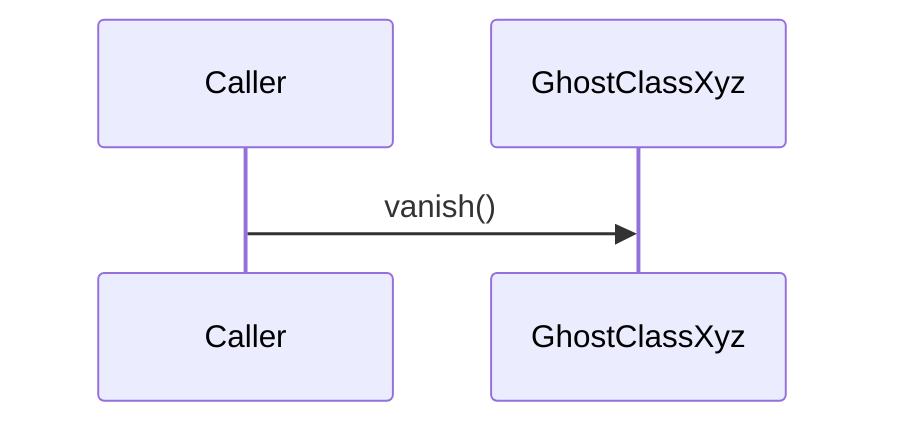
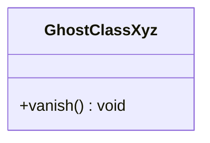

# NON-VACUITY FIXTURE

Deliberately violating input for the `md↔mermaid` gate — see
`scripts/nonvacuity/bad-md-mermaid.mjs`. A `sequenceDiagram` fence beside a
drifted `classDiagram`.

This is the break class for the defect bug 0209 exists to fix. Every other
fixture here holds only class diagrams, so the *foreign-fence skip* — the fix's
central behaviour — could be reverted entirely with `check:nonvacuity` and
`check:crossval` both green (measured, review). It reds two ways: if the skip
stops working the foreign fence produces a parse violation, and if the selector
over-skips the ghost-class violation disappears.

