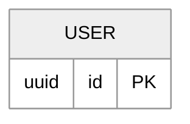

# Bug 0210: `md-mermaid-er`'s fence selector is an allowlist, so a themed ER diagram is dropped silently

## Status

- **State:** Draft — found by review, not yet fixed. Filed because "needs its own
  record" with no record is how a measured finding evaporates.
- **Deferred:** none
- **Found:** 2026-08-22, six-persona review of
  [bug 0209](./fixed/0209-md-mermaid-crashes-on-a-non-classdiagram-fence.md)'s fix.

## Symptom

`tableErAgree()` selects fences with

```ts
const ER_HEADER = /^\s*erDiagram\b/
```

anchored at the start of the fence body. Mermaid's grammar treats `%%` lines as
hidden terminals and permits a `---` frontmatter block, so an ER diagram opening
with a theme directive —

````

````

— parses fine and is **silently not selected**. No violation, no warning, and
`tableErStats` agrees there was nothing to compare.

## Root cause

An allowlist selector is fail-open: it drops whatever it fails to recognise.
This is the identical defect [bug 0209](./fixed/0209-md-mermaid-crashes-on-a-non-classdiagram-fence.md)
found and fixed in the sibling binding, which now selects by **excluding** the
kinds known to be something else, so an unrecognised header still reaches the
parser and produces an attributed finding rather than vanishing.

0209's own record names this hole and scopes it out, deliberately: fixing two
bindings inside one bug fix would have made that change unreviewable. This record
is the home it was deferred to.

## Fix

Test the **declared kind** rather than the raw fence body — `ER_HEADER` against
`diagramKind(b.value)`, allowlist intact. Measured: that selects a themed and a
frontmatter'd `erDiagram` while still rejecting foreign and untagged fences.

**Deliberately not a denylist.** A fail-closed flip was proposed and falsified: it would
route unknown kinds into _both_ parsers (two contradictory findings for one fence), and this
binding accepts `lang === null`, so exclusion would send every untagged fence — 789 in this
corpus — at `parseErDiagram`. The allowlist/denylist asymmetry from
[bug 0209](./fixed/0209-md-mermaid-crashes-on-a-non-classdiagram-fence.md) does not transfer,
because this selector asks a positive one-token question ("is this an `erDiagram`?") where
its sibling asks a negative open-ended one. See
[plan 0214](../plans/0214-extract-the-diagram-kind-predicate.md), "Why this does not make
`md-mermaid-er` fail-closed".

**Owner: [plan 0214](../plans/0214-extract-the-diagram-kind-predicate.md)** ships this fix and
carries the verification boxes below; this record closes `done-otherwise → 0214`.

## Verification

- [ ] Red first: a themed `erDiagram` fixture is not selected today.
- [ ] After the fix it is selected and compared, and `tableErStats` counts it.
- [ ] A `---` frontmatter'd ER diagram likewise.
- [ ] A non-ER fence is still skipped, and the document is not skipped with it.
- [ ] The selector has a break class in `scripts/nonvacuity/`, not only a unit
      test — 0209's review showed the unit suite can catch a selector regression
      while every production gate stays green.

## Out of scope

- **Any kind registry or lockstep gate.** Proposal 006's open question 4 owns that, and
  [plan 0214](../plans/0214-extract-the-diagram-kind-predicate.md) records four falsified
  attempts as the floor for a fifth. Moving `declaredKind()` into `eess-mermaid` — which
  0214 does — is placement, not a registry.
