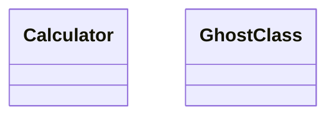

# Bug 0290: a code block nested in a list item or blockquote never reaches `codeBlocks`, so a nested diagram is never checked

## Status

- **State:** Draft. Measured end to end on `main`; no red test yet.
- **Severity:** **High**, a **fail-open**. eess-crossvalidate's md↔mermaid bindings pass a diagram that names a class the code does not have, whenever the diagram sits inside a list item or a blockquote. The nested document also never counts toward the diagram statistics.
- **Origin:** self-found · design review of a fence-handling fix
- **Reported:** 2026-09-13

## Symptom

`buildDocument` collects code blocks from the root's direct children only. The loop is at `packages/md/src/model/document.ts:109`, and the push at `packages/md/src/model/document.ts:128`.

The md↔mermaid bindings read nothing else:

- `packages/crossvalidate/src/md-mermaid.ts:189`
- `packages/crossvalidate/src/md-mermaid.ts:223`
- `packages/crossvalidate/src/md-mermaid-er.ts:58`

Neither the type's documentation nor the markdown guide says the list is top-level only.

## Reproduce

The fixture is a copy of `packages/crossvalidate/tests/fixtures/calc`, with its `embedded-good.md` as `good.md`. Each document under test runs beside `good.md` through `embeddedDiagramsMatchCode(corpus, project)`, on `main` at `2a2a503`.

````text
top-bad.md
# Top



list-bad.md
# List

- The design:

  ```mermaid
  classDiagram
  class Calculator
  class GhostClass
  ```

quote-bad.md
# Quote

> ```mermaid
> classDiagram
> class Calculator
> class GhostClass
> ```

list-good.md
# Valid nested

- The design:

  ```mermaid
  classDiagram
  class Calculator
  class AddOperation
  ```
````

| Document     | Finding                         | `embeddedDiagramStats` on the document alone |
| ------------ | ------------------------------- | -------------------------------------------- |
| top-bad.md   | `GhostClass` reported at line 3 | 1 document, 1 diagram                        |
| list-bad.md  | **none**                        | **0 documents, 0 diagrams**                  |
| quote-bad.md | **none**                        | **0 documents, 0 diagrams**                  |
| list-good.md | none (correct)                  | 0 documents, 0 diagrams                      |

**This repository cannot see it.** It has no nested mermaid blocks, against 34 at top level, so dogfooding exercises none of this.

## The corruption that must produce a violation

A diagram that names a class absent from code must be reported wherever it sits: at top level, in a list item, or in a blockquote. Its document must count toward the statistics, and a valid nested diagram must add no finding.

## Measured facts for a fix

- **A spike, not kept.** On a branch whose document model is identical to `main`'s, a spike collected code nodes from every descendant.
  - The nested diagram was reported.
  - The eess-md and eess-crossvalidate suites passed.
  - The diagram, crossval, corpus and family gates were green.
- **Nothing pins nesting in either direction.** Adding the deep walk left both suites green.
- **Why it is a break.** Nested blocks entering `codeBlocks` is a behavioural break for md-mermaid and md-mermaid-er adopters, who gain findings, so eess-md's changeset must name eess-crossvalidate (bug 0185).

## Verification ledger

- [x] Nested bad diagrams, in a list item and in a blockquote, pass on `main`; the top-level control is reported; a valid nested diagram adds no finding.
- [x] Nested documents count as 0 in the statistics.
- [ ] Red tests: `list-bad.md` and `quote-bad.md` are reported through both md↔mermaid bindings; `list-good.md` adds nothing; the nested document counts toward the statistics.
- [ ] The fix.
- [ ] A non-vacuity row on the nested shape.

## Related

- [0289](./0289-a-fence-its-container-closes-hides-the-next-line.md): the same model, misreading where a block ends.
- [0292](./0292-a-table-nested-in-a-list-never-reaches-the-model.md): the same loop, for tables.
