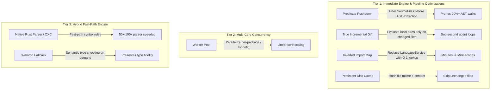

# Proposal 010 — ts: performance at scale — pre-selection from the declared globs, a declared locality, and bound names on the reverse graph

**State:** Draft — reviewed 2026-09-06 (architect · product · enforcement, `Rewrite needed`); **rewritten the same day by the coordinator session that ran the review, not by the filer**; reviewed again the same day by four lenses (`Split and sequence`, every code ask `Held`); **corrected the same day, third pass, against the second review**, which falsified both surviving mechanisms by execution and found five sentences claiming records that did not exist. What changed in the third pass is recorded in the correction callouts and in the second review's own "corrections the review owes". Evidence is printed by `scripts/profile-ts-check.mjs` (in the working tree beside this proposal; uncommitted until this lands) and includes one adopter measurement, unnamed; every number above this repository's size is labelled a projection. The original submission is preserved verbatim as Appendix A. No red test written yet.
**Priority:** Medium — **first draft: High**, on a quotation ("sub-second feedback") that exists in no eess document; **re-rated Medium in the rewrite by the coordinator session, not the filer**, and recorded here because the lane keeps corrections in the record. The ROADMAP scales priority to what the product claims, and the only performance _claim_ eess makes is one sentence: `docs/agent-integration.md:71` says `--changed` "scopes the run … keeping the hook fast on large repos", while `packages/core/src/diff-aware.ts:10` says evaluation is never narrowed. That gap is High and is owned by [bug 0266](../bugs/0266-changed-is-documented-as-scoping-the-run.md), which declares `Implements: proposal 010`. Everything else here is capacity, not a broken claim: `docs/cli.md:141` states the ceiling ("under 500 files … under 3 seconds") and names watch-mode substitution as the workaround — not the tsconfig lever, which is undocumented and is 0266's second item.
**Origin:** inbound — consuming projects with large TypeScript codebases report painful `eess-ts check` latency in agent loops. **One adopter measurement is on record**: taken 2026-09-06 by the coordinator on the author's machine with the same script, over the seven `tsconfig.json` files that project's own architecture tests load. The project is not named — this repo carries no consumer identities — and its numbers are re-sourced into the Evidence section beside this repository's. `work/` holds no support record beyond that. Every other figure was measured on this repository by the script, or is a projection and says so.
**Affects:** `packages/ts/src/builders/*` (`getElements()`), `packages/ts/src/core/glob-evaluator.ts` (the pre-selection fold beside `isDeadGlobTree`), `packages/ts/src/core/element-cache.ts` (memo key), `packages/ts/src/core/module-edges.ts` (one new field on `ModuleEdge`), `packages/ts/src/conditions/reverse-dependency.ts` (`getReverseImportGraph`, `haveNoUnusedExports`), `packages/core/src/predicate.ts` and `packages/core/src/condition.ts` (one declared field each, dialect-neutral — proposed, the ADR under B decides), `packages/core/src/collect-result.ts` (only if that ADR says so), `docs/agent-integration.md`, `docs/cli.md`, `adr/002-ts-morph-ast-engine.md` (bug 0266).

## Problem

`eess-ts check` loads the whole project and evaluates every rule over it on every run. That is correct by design — cross-file rules need the graph — and it is the whole cost. Four things are measurably true about where the time goes.

1. **Project construction is the cost, and the semantic engine is a second cost of the same size.** `project()` and `workspace()` build a ts-morph `Project` from the tsconfigs (`packages/ts/src/core/project.ts:64`), and parsing is eager: every file is parsed at construction. On this repository that is 317ms and +101MB of heap for 265 files. The first thing that resolves a symbol — any dependency predicate, `moduleEdges`, the LanguageService — then builds the type checker: another 278ms and +107MB, paid once per process, by every suite with one graph rule in it, and never by a suite of purely syntactic rules. Both numbers are below, and the second was invisible in the previous draft because its script measured the checker after the edge walk had already built it. On an adopter project of 1,787 files the same two stages are 2.0s and 1.0s, +618MB and +948MB: three seconds and close to a gigabyte before the first rule runs.
2. **`--changed` narrows reporting, not evaluation, and the docs say otherwise.** `DiffFilter` filters the violation list after every rule has run over the full project (`packages/core/src/diff-aware.ts:10`). That is the right default for graph rules, and `docs/agent-integration.md:71` nonetheless promises both scope and speed from it. Bug 0266 owns the sentence.
3. **`haveNoUnusedExports` asks the LanguageService once per export.** `hasExternalReference` calls `findReferencesAsNodes` for every named export (`packages/ts/src/conditions/reverse-dependency.ts:296`): 2.67ms per export steady-state here, 618ms over the 207 own-declaration exports of `packages/core/src`, and the shipped loop iterates 399 because it also walks the 192 barrel re-exports. The substrate that answers almost all of it in one pass — module edges, with the names each edge binds in the target — already exists in the same file's reverse graph, minus one field.
4. **Evaluation is single-threaded.** `runCheck` loads each rule file and calls each builder in sequence. Stated because it is true; the ask that addressed it (E) is held below.

Two bottlenecks from the first draft are gone. "Missing predicate pushdown" is real but small — element collection is 2.2% of project construction here, prunes zero files on this repository's own gates, and the parse it cannot avoid is the rest. "No persistent disk cache" is withdrawn as an ask, because a cache of verdicts is the false green ADR-010 exists to make unrepresentable.

> **Correction to this proposal's first draft.** It described six bottlenecks and pinned a block of numbers in its profile (the previous rewrite called it "eleven"; the block carries twelve figures with a unit, ten without the ratios, and no partition gives eleven — say "its profile block"). It said `arch.internal.rules.ts` held "22 out of 25" rules; the file declares 18 (`grep -c "\.rule("`), none of which uses the type checker — 25 is the two-file total `check:arch` prints, with the other 7 in `arch.rules.ts`. It extrapolated "8.1 GB at 10,000 files" and an out-of-memory crash from one 265-file heap reading. It quoted "sub-second feedback" as eess's primary value proposition; no file under `docs/`, `adr/` or any README says it. It cited code through **four** `file:///Users/…` links that `check:corpus` treats as external and cannot ground — the first review, the coordinator's survey and the previous rewrite all said "ten"; nobody had counted, and that miscount is the review's own, recorded in the second review. It carried a four-phase implementation table, which is a plan's job. Its Scope said "does not change rule semantics or violation message structures", false for three of its six asks. And four of its claims were dropped by the previous rewrite without a record, added here one clause each: "tens of millions of wrapper objects … severe V8 GC pauses" (unmeasured; the measured heap is below), "85–90% of rules" are local (unmeasured; the dogfood census is 16 of 18 in one file), "16.8x overhead" (a ratio of 10.4ms to 0.6ms, both real, neither material), and "214.7MB at peak" (reproduces as the checker-built heap, 208MB, below).

## Evidence

**Measured, 2026-09-06**, by `node scripts/profile-ts-check.mjs` and `node scripts/profile-ts-check.mjs test` after `npm run build`, Node 26.8.1 (ADR-001 pins CI to Node 24; the counts and ratios are the numbers to trust). The default variant loads `workspace()` of the six `packages/*/tsconfig.build.json` files — the same project `arch.rules.ts:15` builds, so these are the numbers `check:arch` pays. The `test` variant loads the test-inclusive `tsconfig.json` files and is the second heap data point. The script prints every timing beside its denominator; the order of its sections is load-bearing and its header says why.

| stage                                                       | build variant (265 files)             | test variant (946 files) | note                                                                                         |
| ----------------------------------------------------------- | ------------------------------------- | ------------------------ | -------------------------------------------------------------------------------------------- |
| ts-morph `Project` construction                             | 317ms · heap +101MB · parsed eagerly  | 650ms · heap +209MB      | paid by every run                                                                            |
| `collectFunctions`, every file                              | 1,409 functions · 7ms · 2.2% of init  | 2,418 · 15ms · 2.3%      | Ask A's whole territory                                                                      |
| `collectFunctions`, `packages/core/src` only                | 206 functions across 58 files · <1ms  | same                     |                                                                                              |
| first semantic query (`getTypeAtLocation`, one node)        | 278ms · heap → +208MB                 | 303ms · heap → +310MB    | the checker build; paid once by the first symbol resolution; never by a syntactic-only suite |
| `moduleEdges`, cold, checker already built                  | 1,500 edges · 22ms                    | 3,971 edges · 43ms       | Ask C's substrate                                                                            |
| reverse graph from those edges                              | 255 targets · <1ms                    |                          |                                                                                              |
| LanguageService, one `findReferencesAsNodes` per own export | 207 exports · 67ms first + 551ms rest |                          | 2.67ms per export steady-state; the shipped loop makes 399 calls (192 barrel re-exports)     |
| import-only name index, same 207                            | 0.12ms lookup · 22ms build            |                          | routes **53 of 58** core files and **180 of 265** to the fallback — the barrels              |
| bound-names field (Ask C's mechanism), same rule            | routes **0 of 58** core, **1 of 265** |                          | the one is `packages/ts/src/predicates/index.ts:13`, `export * as classPredicates`           |
| disagreements, index vs LanguageService                     | 0 of 207                              |                          | **a control, not evidence**: both report zero unused on a corpus whose gate is green         |

**The adopter measurement**, same script, `--tsconfig` over the seven `tsconfig.json` files that project's own architecture tests load through seven separate `project()` calls — so a real run there pays seven parses and seven checker builds; this is one merged workspace, a lower bound — with `--exports 300` so the LanguageService sample finishes:

| stage                                                       | adopter project (1,787 files)                          | note                                                                                   |
| ----------------------------------------------------------- | ------------------------------------------------------ | -------------------------------------------------------------------------------------- |
| ts-morph `Project` construction                             | 2,024ms · heap +618MB · parsed eagerly                 | 0.35MB per file, twice this repository's density                                       |
| `collectFunctions`, every file                              | 6,726 functions · 30ms · 1.5% of init                  | its largest app's `src` (344 files): 2,461 in 3ms                                      |
| first semantic query                                        | 1,001ms · heap → +948MB                                | three seconds and close to a gigabyte before the first rule                            |
| `moduleEdges`, cold, checker already built                  | 7,326 edges · 82ms · reverse graph 1,146 targets · 2ms |                                                                                        |
| LanguageService, per own export, **sample of 300** (capped) | 292ms first + 4,381ms rest · **14.65ms per export**    | 5.5x this repository's per-export cost; 166 foreign declarations skipped in the sample |
| import-only name index                                      | routes **734 of 1,787** files to the fallback          | 169 of the 344 in scope                                                                |
| bound-names field                                           | routes **192 of 1,787** (11%)                          | 76 of 344 in scope — namespace, default and dynamic imports are common there           |
| disagreements                                               | 0 of 300                                               | control                                                                                |

What the tables say. Construction and the checker build are the cost, and nothing a rule does can move either; on the adopter they are 3.0s together. Pre-selection (A) prunes a step that costs 2% here and zero files on `check:arch`. The unused-exports instrument (C) is where the asymptotics are: once the checker exists — and it exists for any suite with a graph rule — the index costs 22ms against 618ms for the LanguageService over the same exports, about 28x on this repository, growing with exports × files on the LanguageService side and with edges on the index side — on the adopter the per-export cost is already 14.65ms, so 300 exports cost 4.7s where the edge build costs 84ms. **But only with the right field:** an index built from `ModuleEdge.names` sends 180 of 265 files back to the LanguageService, because every package barrel re-exports nearly every module and a `reexport` edge's `names` are outward names; a field carrying the target-side bound names sends one here — and **192 of 1,787 on the adopter**, because every-export importers (namespace, default, dynamic) are common there. The win is bounded by that share, and the proposal claims no more.

**The agreement count is not evidence of equivalence.** Zero disagreements over 207 exports is what you get on a corpus whose own `eess/no-unused-exports` gate is green: both instruments report zero unused, and so would an index that returned "used" unconditionally. It is kept in the table as a control against false reds. The evidence for C is the fixture under Acceptance criteria, recorded by value, on which the LanguageService reports exactly one unused export and every mechanism the previous drafts proposed reports the wrong set.

**Three data points on heap, and why this proposal still makes no memory claim.** This repository: 265 files cost +101MB to parse and +208MB with the checker built; 946 files cost +209MB and +310MB. The adopter: 1,787 files cost +618MB and +948MB — 0.35MB per file parsed and 0.53MB with the checker, twice this repository's density, because its files are larger and type-heavier. A straight line at the adopter's own density reaches Node's default old-space ceiling (about 4GB on 64-bit) somewhere between 7,000 and 8,000 files with the checker built — a **projection**, stated so the shape is visible. It is the first measured basis the first draft's out-of-memory concern has had, and it is still not a claim: nobody has measured a 10,000-file project with eess, and the adopter's own architecture suite loads seven separate projects rather than one, which multiplies the parse and divides the peak.

**The rule census, measured.** `arch.internal.rules.ts` declares 18 rules (`check:arch` runs 25 across it and `arch.rules.ts`). None uses `haveReturnType`, `acceptParameterOfType`, `havePropertyType` or any type query. Two (`eess/no-dead-modules`, `eess/no-unused-exports`) need the resolved import graph and therefore the checker; the other 16 need one file's AST each. All 25 select through `**/packages/*/src/**` — a `parent-dir` glob with `absolute` base — over a workspace that is exactly those six `src` trees, which is why pre-selection prunes nothing here.

**What was measured about `--changed`, by execution.** A rule scoped to a folder, with its population narrowed to a one-file diff elsewhere, reports `examined = 0` and the zero-examined configuration finding from `packages/core/src/terminal-builder.ts:290`, which carries `bypassFilters` and survives `filterToChanged`. Measured twice, independently, during the first review; it is why B is two questions rather than a mechanism.

**What was measured about the previous rewrite's mechanisms, by execution.** Both were falsified on this repository's own code before the second review returned, and the reviewers measured them again independently: the pre-selection rule refused every one of the 25 dogfood rules; the name index reported two re-export spellings as false reds. Both are recorded in the second review and corrected in the mechanisms below.

## Proposed API

### Ask A — pre-selection from the declared-glob tree (`packages/ts`)

**What exists.** Every builder's population is collected once per process and memoized on `(project, options)` — `packages/ts/src/builders/function-rule-builder.ts:119` and its siblings, plan 0075. The question "which path globs narrow this rule" is already answered by the declared-glob tree: `resideInFile`/`resideInFolder` declare their glob with a kind and a base (`packages/ts/src/predicates/identity.ts:104`), `RuleBuilder.globs()` returns the stamped trees (`packages/ts/src/core/rule-builder.ts:198`), `not`/`or` compose through `negateGlobs`/`combineGlobs` (`packages/core/src/glob-site.ts:292`, `packages/core/src/glob-site.ts:316`), and `isDeadGlobTree` (`packages/ts/src/core/glob-evaluator.ts:29`) already walks that tree against the project with set semantics to answer "does anything match". ADR-002 named "file-set narrowing via `resideInFolder`" as the 5000+ file mitigation (`adr/002-ts-morph-ast-engine.md:96`) and it was never built.

**Mechanism.** Pre-selection is the set-valued dual of `isDeadGlobTree`, and it lives beside it in `packages/ts/src/core/glob-evaluator.ts` so one walker serves both readers and the existing soundness enumeration (`packages/ts/tests/core/glob-evaluator-soundness.test.ts`, every expression of a few combinator nodes over {dead, live, opaque} against set semantics) covers both. The shape of the tree, measured: `globNode()` (`packages/core/src/glob-site.ts:254`) wraps every single declaration in a **one-child `any`**, so a bare `.that().resideInFolder(g)` roots at `any`; a rule's `globs()` is an array of such trees, one per predicate, ANDed; and a positive leaf's `polarity` is `undefined`, not `'positive'`.

- A rule's pre-selected file set is the **intersection over its selector-position trees** of each tree's set.
- One tree's set: `any` = union of its children; `all` = intersection; a negative leaf, an opaque child, a non-path kind, or a syntactic fault = **the universe** (that tree does not narrow; the others still do); a one-child `any` is its child. `polarity` is read as `!== 'negative'`.
- A positive `file-path` or `parent-dir` leaf is evaluated **per `SourceFile` with the predicate's own logic** — the absolute path, and `relativeToRoot` against the registered root that contains the file — never against a pre-relativised view. `pathUniverse()`'s tsconfig-relative view is single-root under `workspace()` (207 of 265 entries stay absolute; the kernel's docstring says the views are "for message wording") and is not usable for this.
- **Fallback on empty:** a pre-selected set that is empty while the universe is not falls back to full collection. Otherwise the floor mints `zeroExaminedViolation` (`packages/core/src/vacuity-findings.ts:55`) whose remedy is to widen a selector that is correct. With the fallback, "new findings: none" is true; without it, it is not.
- `examined` is unchanged: it is the post-predicate count (`packages/core/src/rule-builder.ts:381`), and a sound pre-selection removes only files the predicate would reject. `sourceEmpty()` and the dead-glob diagnosis keep reading the whole project. `excluding()` never touches the population and its globs are stamped `exclusion`, so "selector position only" already leaves it out.

**Memo and exemptions.** The element cache forbids memoizing a filtered population under the plain key (`packages/ts/src/core/element-cache.ts:58`). Pre-selection keys the memo on `(project, options, selection)`, where `selection` serialises every leaf used as `(glob, kind, base, polarity)` — not the glob string alone, or `resideInFile('x/**')` and `resideInFolder('x/**')` share a key over different populations — and is **derived from `_predicates` at `getElements()` time**, never stored on the builder, because builders are copy-on-write and a stored key would be copied onto a clone with a different predicate. A rule with nothing to pre-select keeps today's key. The exempt builders are **derived, not enumerated**: any builder whose `getElements()` is not the `project.getSourceFiles().flatMap(collect)` shape — `ScopedFunctionRuleBuilder`, the two graphql builders, `slices()`, the smell builders — never reaches the hook because they override `getElements()`.

**Headline, measured.** On `check:arch` every rule selects the whole workspace, so pre-selection prunes **zero files and saves 0ms** here. Its ceiling on any project is the collection share — 2.2% of a cold run here, 1.5% on the adopter. And for a mixed suite (one unscoped rule beside N scoped ones) the work is one full walk plus N partial walks, which is strictly more than today's single memoized walk. The saving exists only in a process where every rule is scoped and the scopes do not cover the universe. That arithmetic is Open Question 4's, and the honest alternative is a `pending` row in ADR-002's enforcement table saying the mitigation was measured and not built.

> **Correction to this proposal's first draft and its first rewrite.** The first draft proposed `getElements(pathFilter?: (filePath: string) => boolean)`, a callback receiving the absolute path, under which `resideInFolder('packages/core/**')` — the acceptance criterion's own example — matched nothing; it also claimed the mechanism "prunes 90%+ of AST object allocations", and the parse is eager and unaffected. The first rewrite replaced the callback with a rule that read "refuse to narrow when the tree's root is `any`, when any leaf is negative, or when any child is opaque" and matched leaves "against `pathUniverse()`"; measured, that rule refused all 25 dogfood rules (every single-leaf tree roots at `any`) and the universe's relative view would have pruned every non-primary package under `workspace()` — bug 0035's class, instantiated one line above the fixture that catches it. The words "refuse for an `any` root" came from the first review; the rewrite copied them without checking the tree. Both are recorded in the second review.

### Ask B — a declared locality, and what a diff-scoped run counts (two ADR questions; a shape is proposed, the ADR decides)

The first draft proposed three "radii" and an execution strategy. The first review measured the one case the draft never stated and found the strategy cannot be written until two things are decided at the ADR level. This ask proposes a shape for each and marks both as the ADR's to decide.

**B1 — a declared locality on predicates and conditions.** A field beside `globs` on **both** kernel types — `Predicate` (`packages/core/src/predicate.ts:23`) and `Condition` (`packages/core/src/condition.ts:94`) — because the fold runs over both, as `declaredGlobsOf` does, and because predicates genuinely need it: `importFrom` in predicate position reads `edgesOf` (`packages/ts/src/predicates/module.ts:45`), while `resideInFolder` reads only the unit. Proposed values, dialect-neutral so `eess-md` can declare a document-local rule through the same field: `locality?: 'self' | 'adjacent' | 'graph'` — `self` is the unit alone; `adjacent` is the unit plus what it references **in either direction** (the deleted-target case below needs importers of a changed file, the reverse direction); `graph` is everything. The ADR names them; these are proposed. The fold: any undeclared member forces `graph`, and a `satisfy(defineCondition(…))` body is opaque and therefore `graph` — a default forced by ADR-009 rule 1, stated here as forced rather than left inside the open question. `correspondence()` is `graph` by construction, because a join over one narrowed side manufactures missing-on-the-other-side findings. Declared rather than inferred **by analogy with** ADR-014 §3 (`adr/014-the-emitter-refuses-a-verdict-without-evidence.md:187`: a declaration is one a caller made over a live instrument, never one eess infers from a configuration) — an analogy the ADR under B may adopt or reject; the previous rewrite presented it as already decided, and it is not.

**B2 — what evidence a diff-scoped run carries.** Under ADR-010, `examined` is counted at the family's examining seam over the population the rule was handed. Narrow that population to a diff and a rule scoped elsewhere reports zero, and the floor reds it with a finding whose two remedies are both wrong (the selector is correct; `.expectEmpty()` expires the next time the folder is in the diff). Two honest shapes exist and neither can be chosen in a plan: a new field on the receipt (`packages/core/src/collect-result.ts:25`) saying "evaluated over a diff of N files, K in this rule's scope" — an amendment to ADR-010 §1 and to ADR-014, whose enforcement table requires a falsifier for every flag that can quiet a zero; or marking zero-overlap rules `notRun`, which the receipt defines as "explicitly disabled", and minting that from a diff is inference of the kind §3 refuses. **An ADR decides this.**

**The cases the mechanism must answer, whichever shape wins.**

- _Empty diff._ `diffAware` returns `new DiffFilter(new Set())` when `git diff` prints nothing (`packages/core/src/diff-aware.ts:104`); today that is a clean run, and [bug 0221](../bugs/0221-diffaware-cannot-tell-no-changes-from-wrong-base.md) already records that it is indistinguishable from a wrong base. A diff-scoped run over an empty diff must be clean, and the hook recipe at `docs/agent-integration.md:71` runs on every stop of a fresh branch.
- _Working-tree diff._ `git diff --name-only <base>...HEAD` (`packages/core/src/diff-aware.ts:86`) excludes uncommitted changes. Today an agent's uncommitted edit is evaluated and its findings filtered; under diff-scoping it would not be in the population at all — the agent loop this ask exists for is the case the first draft was blind to. A diff-scoped mode needs a diff that includes the working tree, which is a change to `diffAware`'s premise and belongs in the same ADR.
- _Rule-file change._ Tightening a threshold edits only `arch.rules.ts`, which is not under `src/`; a diff-scoped run would evaluate zero source files against the new rule and pass. It must detect a change to the rule file, its import closure, the eess version or the compiler options and run full.
- _Deleted or moved target._ The deleted file is in the diff with no AST; its unchanged importer's edge is now unresolved, and `notImportFrom` keys on `resolvedPath` (`packages/ts/src/conditions/dependency.ts:75`). `adjacent` locality must therefore include the importers of every changed file, which the existing reverse graph (`packages/ts/src/conditions/reverse-dependency.ts:47`) already answers.
- _`--changed` is `eess-ts`-only_ (`packages/ts/src/cli/index.ts:90`) while `DiffFilter` is kernel; the ADR should say whether a diff-scoped mode is a ts CLI feature or a family one.

### Ask C — bound names on the existing reverse graph, with the LanguageService as the fallback (`packages/ts`)

**What exists.** `getReverseImportGraph` (`packages/ts/src/conditions/reverse-dependency.ts:47`) already inverts `moduleEdges` into target → importers over every edge kind, cached per ts-morph `Project`, and feeds `beImported()` and `onlyBeImportedVia()`. `ModuleEdge.names` (`packages/ts/src/core/module-edges.ts:146`) carries the **inward** name for an `import` edge and the **outward** name for a `reexport` edge — `export { inner as outer } from` records `outer`, `export * as NS from` records `NS` — by design, because `names` feeds finding identity and cannot change in place.

**Mechanism.** One new field on `ModuleEdge`: `boundNames?: readonly string[]` — the names **as they exist in the target** that this edge binds, `undefined` when the edge binds every export (`export * from`, `import * as NS`, `export * as NS`, a default import, `dynamic`, `require`, `type-expression`). Populated from the specifier's `getName()` for both `import` and `reexport` specifiers, so `export { inner as outer } from` records `inner`. `names` is untouched. The reverse graph records, per target, the union of its importers' `boundNames` and a flag when any importer edge is `undefined`-bound. `haveNoUnusedExports` then answers each named export in three steps: the union has the name → used; the file has an every-export importer → ask the LanguageService exactly as today; otherwise → unused.

**Why the field and not a routing rule.** The previous rewrite indexed `names` and routed only nameless edges to the fallback; measured, that reported `export { inner as outer } from` and `export * as NS from` as false reds, and the sound repair — consult `import` edges only, route every other edge to the fallback — sends 53 of 58 core files and 180 of 265 files back to the LanguageService on this repository, because the package barrels re-export nearly every module. With `boundNames` the fallback runs for 0 core files and 1 of 265 (the `export * as` in `packages/ts/src/predicates/index.ts:13`). The field is the mechanism; the routing rule is what a plan does until the field exists, and it gains nothing where barrels exist.

**Deltas, declared** — three, where the previous rewrite said none:

1. An export the union does not contain, in a file with no every-export importer, is reported unused **without the LanguageService's `try/catch` ever being asked** (`packages/ts/src/conditions/reverse-dependency.ts:296` returns "referenced" on error today). The case that fails open today becomes a finding. Fail-closed and right under ADR-009, and a delta the changelog states.
2. The verdict moves onto the reverse graph's per-project cache, whose invalidation does not cover a target-side change (`packages/ts/src/core/module-edges.ts:266`, measured both directions). The CLI and `--watch` rebuild via `resetProjectCache()`; a consumer holding a project across a mutation gets a stale answer where today they get a live one. Declared where the element cache declares its own.
3. **Bug 0243's verdict is inherited by construction and stated as such.** `export { x } from` binds `x`, so a barrel's re-export counts as a use of `x` — which is [0243](../bugs/0243-a-barrel-re-export-counts-as-a-use.md)'s wrong verdict, today produced by the LanguageService and under C by the index. A fix for 0243 — follow the re-export chain to a non-re-export consumer — is a walk over the same graph, so it is compatible with C and can be its own phase; C does not fix it and does not make it worse.

**Prerequisite in the same function.** [Bug 0265](../bugs/0265-a-barrel-reports-a-re-export-at-another-files-line.md): `findUnusedExportsInFile` (`packages/ts/src/conditions/reverse-dependency.ts:247`) reports a barrel's re-export at the declaring file's line under the barrel's path. It is phase 0 of C's plan and closes in C's PR; Scope C says findings move only where 0265 moves them.

**Cost.** 22ms to build the edges and the graph once the checker exists — and it exists for any suite with a graph rule — against 618ms for the LanguageService over the same 207 exports: about 28x on this repository, and on the adopter 84ms against 4.7s for a sample of 300 exports, growing with exports × files on one side and edges on the other. The previous draft said "about 2x" because its script measured the edge walk before the checker existed and charged the checker build to the edges; recorded in the second review.

**Dogfood.** `eess/no-unused-exports` runs over every package at `arch.internal.rules.ts:134`, so the win lands on `check:arch`'s own path, and the one `export * as` in the corpus is where the fallback is exercised for real.

> **Correction to this proposal's first draft and its first rewrite.** The first draft's acceptance criterion demanded "identical findings to the LanguageService … barrel re-exports, dynamic imports" while its mechanism marked every export behind a star or namespace importer "potentially referenced"; both could not be true, its break class was inverted, and its "23,275x" compared a warm lookup to a cold search. The first rewrite keyed the index on `names`, said three times that findings do not change, and listed seven fixture spellings that omitted exactly the two that break — `export { a as b } from` and `export * as NS from` — both measured as false reds by the coordinator and by two reviewers. Both are recorded in the second review.

### Withdrawn from this proposal

**D — a persistent cache of findings: rejected as specified.** `localFindings: []` replayed from disk is a pass reconstructed from a previous program, and under ADR-014 §2 a replayed `examined` is a supplied number over a loop that skipped everything. The per-file mtime + hash key misses invalidators this repo has already measured or recorded: a change to an edge's _target_ (`packages/ts/src/core/module-edges.ts:266` — "measured, both directions"), per-root compiler options and `paths` (`packages/ts/src/core/per-root-compiler-options.ts`, bug 0058), the rule file and its import closure, preset options, the engine version, and `declare module` augmentations. Its own named break class — invalidation not propagating up the reverse graph — is the one its schema cannot compute for a deleted file. The only on-disk artifact eess ships stores accepted violations and never passes (`packages/core/src/baseline.ts:134`), and a cache an agent can edit to `localFindings: []` is the stampable marker ADR-009 rule 3 warns about. The first review **argued** this from the repo's records; nothing about a disk cache was measured. **A cache of parsed facts only** — edges and populations, never findings — keyed on a program-wide hash, the rule-file hash, the engine version and the per-root options, contributing replays to the receipt as a distinguishable kind of evidence and disclosing them, with "run cold and say so" as the only behaviour for an unreadable or mismatched cache, may return as its own proposal **after B1 says what is cacheable at all**.

**E — a worker pool: held.** As first written it contradicted `workspace()`'s reason for existing — one merged ts-morph `Project` so cross-package edges are visible to every graph condition — and ADR-006's rule shape: a rule file calls `workspace([...])` itself, and nothing represents "this builder narrowed to tsconfig X" for a worker to receive without config-driven parameterisation of rule files. "Workers return plain `ArchViolation[]`" drops the receipt; a bare array reaching the kernel's merge (`packages/core/src/collect-result.ts:120`) is the no-receipt finding. Per-process tallies — edge coverage, comment suppression, `violationsWritten`, the once-per-process notice at `packages/core/src/diff-disclosure.ts:92` — never cross an isolate. **Unhold condition:** (1) a unit of work ADR-006 permits — one worker per rule _file_, each loading the full workspace, which parallelises CPU and not memory, or `self`-/`adjacent`-locality rules (B1) over a per-package project with `graph` rules kept in the coordinator; (2) the receipt crossing the boundary intact — `structuredClone` preserves an array's own properties and `JSON.stringify` drops them, re-measured by the second review; (3) tallies forwarded and merged; (4) a worker-death finding with `bypassFilters`; (5) acceptance criteria, written below for the day it unholds. Open Question 2 is moot until then.

**F — a hybrid native (OXC) engine: rejected in this lane.** ADR-002 is Accepted and rejects OXC and SWC by name ("Speed is not the bottleneck; type resolution is the hard problem"). ADR-007 decides one seam and one engine, rejects a second engine as YAGNI, and names the signals that would trigger one — TypeScript 7.1's API, a Corsa-backed build, a Wasm build, a reusable project-service layer; OXC is none of them. Its confinement row is `pending` with ts-morph imported in 69 files under `packages/ts/src`. `adr/009-agent-first-failure-surfaces.md:227` states that "cross-check it with a second parser" is not an available answer. Two engines give two sources of `line`, on which exclusion comments anchor (`packages/core/src/exclusion-comments.ts:475`), and of `message`, on which the baseline hash keys (`packages/core/src/baseline.ts:134`). **Nothing is filed for it and nothing will be by this proposal**: the previous rewrite said "refiled as an ADR-002 amendment", which named an artifact that does not exist. Re-entry is an ADR-007 signal firing and its confinement row reaching `gated`; whether OXC belongs on that signals list is an edit to ADR-007 the author makes.

## Alternatives considered

- **Full rewrite in Rust.** Abandons rules-as-code and every language-dependent ADR (001, 003, 005). Rejected by ADR-007 for the same reason.
- **Raw `ts.createProgram` without ts-morph.** ~2x speed, ~3x memory by the first draft's reckoning, unmeasured here; ADR-002 rejected it for the verbosity tax, and ADR-007's seam is where that trade would be made if ever.
- **TypeScript project references.** Requires adopters to restructure into composite projects; not a library concern.
- **The lever that works today: a narrower tsconfig, or one `project()` per rule file.** Undocumented, and its cost — cross-file conditions lose visibility, the same trade B makes explicit — is undocumented too. Bug 0266's second item.
- **Do nothing but fix the docs.** Honest for the claim gap (bug 0266 is that); does not address bottleneck 3, which is real and cheap to fix.

## Acceptance criteria

Per ask: the break class; which rows are **harness rows** in `scripts/check-nonvacuity.mjs`'s contract (perturb input, drive the production `check:*` gate, exit 1 proven / 0 vacuous / 2 premise broke) and which are **mutation tests** in `packages/ts/tests/` (a vitest test that reds when the implementation is mutated a stated way); and the manifesto tier.

**A — pre-selection.**

- Break class: pre-selection prunes a file the predicate would have matched. Prunes-to-zero is caught by fallback-on-empty; prunes-to-a-non-empty-subset is silent, because `examined` is post-predicate, and is the one to guard.
- Tier 2 mutation tests over a committed two-root `workspace()` fixture: a project-relative `resideInFolder('src/x/**')` **and** a `resideInFile` leaf, each in both bases, with a planted violation in the second root. Mutations: match against the primary root's relative view — the planted violation vanishes — must red naming the fixture rule's id; drop the fallback-on-empty and pre-select to nothing — the floor's finding appears where the planted violation should — must red.
- **Engagement assertion**, so an implementation that never engages cannot pass: over the dogfood suite the number of rules whose pre-selected set was a strict subset of the universe equals what the mechanism claims (25 today, all on `**/packages/*/src/**`, which is the universe — so 0 strict subsets and 25 engaged-but-equal, both asserted), and per rule the set is non-empty.
- Harness row: `gateArch` already plants a probe under `packages/core/src` and must still red `eess/adr002-no-raw-typescript` with pre-selection engaged. It exercises the `parent-dir` × `absolute` cell only; the fixture above covers the other three.
- The dogfood differential the previous rewrite proposed (subjects with and without) is vacuous here — equal by construction — and is dropped.
- New findings: none, with fallback-on-empty. Release: `patch`, since nothing observable ships.

**B — at the ADR level.** (i) A scoped rule with a diff elsewhere carries an honest receipt and no configuration finding; (ii) an empty diff is clean — buildable today as a regression guard (`packages/core/src/diff-aware.ts:104`); (iii) a rule-file change forces a full run; (iv) a cycle between a changed and an unchanged file is reported — buildable today, since evaluation is never narrowed; (v) a deleted target re-evaluates its importer's edge rules; (vi) a declared-`self` condition that reads another unit is caught by a differential fixture — full versus diff-scoped, identical findings over a corpus with cross-file dependency — because a wrong declaration is a claim an author can get wrong and a written one has a falsifier. Whatever the ADR mints for evidence under scoping needs an id, a cause-naming message, a remedy verified to remediate, `bypassFilters`, and a row in `packages/ts/tests/core/every-config-finding-is-classified.test.ts`.

**C — bound names.**

- Break class, un-inverted: an every-export importer routes to the fallback and never marks every export used; and an aliased or namespaced re-export is keyed on the target's name, never the outward one.
- Tier 2 differential: set identity of `(file, line, name)` between today's LanguageService path and the mechanism, over the fixture below, asserted as sets. Then over `packages/ts/src`, which contains `export * as classPredicates`, not only `packages/core/src`, which contains neither breaking spelling — the `packages/core/src` run is kept as a **control** (both report zero and must still agree).
- Mutation tests over the fixture: treat an every-export edge as covering every name → `dead` is never reported → red; delete the fallback → the destructured `baz` is reported unused → red; key re-exports on the outward name → `inner` is reported unused → red.
- Harness row, on the production path: plant `packages/core/src/__nonvacuity_probe_dead__.ts` (`export const dead = 1; export const alive = 2`) and a sibling `import * as P from './__nonvacuity_probe_dead__.js'; export const x = P.alive`, run `eess-ts check arch.internal.rules.ts --format json`, and assert `eess/no-unused-exports` fires on the probe naming `dead`. Reds today, reds after C only if the every-export route reaches the fallback, goes green under the first mutation. A sibling probe with a destructured `await import()` importer asserts the rule does **not** fire.
- Prerequisite: bug 0265's red test is green first, as phase 0 of C's plan; 0243 is inherited and stated.
- New findings: none. Release: `@nielspeter/eess-ts` minor — findings move where 0265 moves them and appear where delta 1 makes a fail-open case red; the changelog says both.

**The fixture, recorded by value** (the freeze rule: a load-bearing input lives in the corpus, not a session). Committed by C's plan as its first phase; until then this is the record.

```ts
// src/lib.ts
export function foo(): number {
  return 1
}
export function bar(): number {
  return 2
} // the only unused export
export function baz(): number {
  return 3
}
export function inner(): number {
  return 4
}
export const dead = 1 // unused; behind a namespace importer
// src/use-ns.ts
import * as NS from './lib.js'
export const v = NS.foo() // reads foo, never NS.dead
// src/barrel.ts
export * from './lib.js'
export { inner as outer } from './lib.js' // aliased re-export
export * as L from './lib.js' // namespace re-export
// src/use-barrel.ts
import { outer, L } from './barrel.js'
export const w = outer() + L.baz()
// src/use-dyn.ts
export async function lazy() {
  const { baz } = await import('./lib.js')
  return baz()
}
// src/use-type.ts
export type T = import('./lib.js').foo
// src/use-req.cjs
const { foo } = require('./lib.js')
module.exports = foo
```

Expected, by the LanguageService today and required of the mechanism: `lib.ts` unused = `{ bar, dead }`; `barrel.ts` unused = `{}` after 0265 anchors the lines. Every previous mechanism in this proposal's history reports a different set on this file.

**E — for the day it unholds.** A worker killed mid-run reds naming the package, never a partial green; every receipt field survives the boundary, asserted property by property; the coordinator's tallies equal a single-process run's over the same input.

**Bug 0266 (the docs).** `docs/agent-integration.md:71` no longer says "scopes the run" or "fast"; `docs/cli.md` names the tsconfig lever and its cost; ADR-002's enforcement table carries a `pending` row for its never-built mitigations. Instrument: `check:corpus`, Tier 1 — it proves the `path:line` pointer beside the corrected sentence resolves, not that the sentence is true; the claim is review-enforced, and this proposal says so rather than naming `check:docs-code`, which type-checks code fences and reads no prose (the previous rewrite named it).

## Open questions

1. **The declaration's shape (blocks B, and any return of D).** A forgeable field beside `globs`, or a registry keyed like `packages/core/src/cardinality.ts`? Two facts the ADR must decide against: ADR-010 §2 says of the kernel's registries that "nothing may add a fourth" (`adr/010-a-pass-is-constructed-from-evidence.md:136`), and ADR-014's enforcement table carries a `pending` row "No new kernel registry is added"; and `cardinality.ts`'s own docstring says of the registry it keeps that "what actually stops a consumer doing this: not enough" — so the alternative is not unforgeable either. The default for an undeclared or user-authored member is `graph`, forced by ADR-009 rule 1 and stated in B1 as forced. Whether locality may be inferred from the builder at all is **not** closed by ADR-014 (the previous rewrite said it was; §3 is about a declaration against a configuration, and the carry-over is an analogy) — it goes back to the author with the analogy stated.
2. **Worker memory budgets.** Moot until E unholds; kept so it does not return as a new question.
3. **Where a cache lives** — withdrawn with D. If D returns, this is a threat-model question rather than a convention one, a reframing the first review made and this proposal adopts: a committed or editable cache that carries verdicts is a green stamp, so it decides whether verdicts can be cached at all.
4. **Is A worth its memo key?** Measured: 18 dogfood rules on one shared scope and 7 on five per-package scopes, so six walks against one, for a step that costs 7ms; 0 files pruned on this repository; ≤2.2% here and 1.5% on the adopter; negative for a mixed suite. The honest alternatives are to build it as the ADR-002 mitigation with that arithmetic in the plan, or to record the mitigation as `pending` in ADR-002's enforcement table and not build it. The author's call, and a plan cut from A cannot freeze to Ready while it is open.

## Scope

- **A:** `@nielspeter/eess-ts`, `patch` — no observable change by criterion; `examined` unchanged; new findings none (with fallback-on-empty).
- **B:** an ADR first (an ADR-010 §1 and ADR-014 amendment, plus the `diffAware` premise). Then `@nielspeter/eess` (one optional declared field on `Predicate` and `Condition`; possibly one on `CollectResult`) and `@nielspeter/eess-ts`. **Both branches stated:** an optional field is additive, `minor`; if the ADR makes the receipt field required, that is a break on `0.x` — `minor`, marked, and the changeset **names** `-ts`, `-md`, `-mermaid`, `-gherkin` and `-crossvalidate` (bug 0185's class), as ADR-014's own break did.
- **C:** `@nielspeter/eess-ts`, `minor`. One new optional field on `ModuleEdge`; `names` untouched, so finding identity is untouched. Findings move where bug 0265 moves them (phase 0, same PR) and appear where delta 1 makes a fail-open case red; 0243 inherited; the changelog says all three.
- **Bug 0266:** `none` changesets; docs and an ADR table row; its own PR, before any of the asks.
- **D, E, F:** nothing ships from this proposal.
- **Semantic deltas, stated per ask** because the first draft claimed there were none and the first rewrite claimed C had none: A none; B changes what a diff-scoped run's receipt says, by ADR; C three, declared above; D would have changed what a green run means and is withdrawn for it.

## Review — 2026-09-06

**Ruling: Rewrite needed**

Three lenses reviewed this independently against a coordinator survey of `packages/*/src`, and two of the three took measurements rather than arguing. The material is worth keeping: bottleneck 4 is real and its substrate (module edges) is right, the base profile reproduces to within noise on the exact workspace `arch.rules.ts:15` builds, and Ask A is the mitigation `adr/002-ts-morph-ast-engine.md:96` promised and never built. The container is wrong: the Evidence section presents linear projections beside measurements under one heading, the Priority rests on a quotation that exists in no eess document, the Scope sentence is false for three of six asks, no ask names a non-vacuity fixture, two asks have no acceptance criteria at all, a four-phase table does a plan's job inside a proposal, and the proposal never cites ADR-007, ADR-010 or ADR-014 although every correctness problem found lives at the seams those three govern. Two of the six asks as written manufacture the false green ADR-010 exists to make unrepresentable.

**Recorded disagreement on the verdict.** The architect and product lenses each wrote `Split and sequence`; the enforcement lens wrote `Rewrite needed`. The product review's own opening says the proposal is "not shippable as one thing, and not yet splittable either … only after the Evidence and Priority sections are rewritten", which is the board's definition of `Rewrite needed` ("the shape or the container is wrong") rather than of `Split and sequence` ("split before planning" — none of the six can be `/plan`ned from the text as it stands). Proposal 001's first draft carried the same defect — gates specified with nothing that fails when they don't hold — and was ruled the same way. The split is already visible and is recorded below so the rewrite does not have to rediscover it; the rewrite is what makes it dispatchable.

**What reproduces, and one correction the review owes.** The architect re-measured the proposal's profile on `workspace()` of the six `tsconfig.build.json` files: 265 files, init 327ms against the proposal's 329.9ms, heap 99MB against 111.4MB, 1,409 functions in 6.7ms full and 206 in 0.4ms narrowed to `packages/core`. The coordinator's survey first claimed no rule file builds that project, from a measurement of the test-inclusive tsconfigs (946 files, 732ms, +227MB); that claim was wrong and the architect's re-measurement corrected it. Both measurements agree on the fact that matters for Ask A. The two projects also give one real data point against the memory extrapolation: 3.6x the files cost about 2x the heap, so "8.1 GB at 10,000 files" assumes a per-file marginal cost the repo's own numbers do not show.

**Existing code survey, per ask.** A: exists in part — every builder's population is already collected once per process and memoized on `(project, options)` (`packages/ts/src/builders/function-rule-builder.ts:119`, plan 0075), so "for each rule eess collects every element" is not what happens today; and the "which globs narrow this rule" question is already answered by the declared-glob tree (`packages/ts/src/core/rule-builder.ts:198`, composed through `not`/`or` at `packages/core/src/glob-site.ts:292` and `packages/core/src/glob-site.ts:316`, with per-root path views at `packages/ts/src/core/path-universe.ts:25`). B: genuinely new; no locality concept exists anywhere in `packages/*/src`; the precedent for declared condition metadata is `packages/core/src/condition.ts:94`. C: exists in the same file as the condition — `getReverseImportGraph` (`packages/ts/src/conditions/reverse-dependency.ts:47`) already inverts `moduleEdges` into target → importers, cached per project, and feeds `beImported()` and `onlyBeImportedVia()`; `ModuleEdge.names` (`packages/ts/src/core/module-edges.ts:146`) already carries the inward name. D: genuinely new; every cache in the repo is in-memory and every one records the false green it was measured to manufacture. E: genuinely new. F: not a proposal-lane ask.

**A — right direction, wrong mechanism, wrong headline.** Parsing is eager at `packages/ts/src/core/project.ts:64` and `getSourceFiles()` materialises every file whatever is collected afterwards, so pushdown cannot touch bottleneck 1; it removes model construction for out-of-scope files, which is 6.7ms of a 327ms cold path on this repo — about 2%, the same ratio the proposal's own table shows (10.4ms of 329.9ms). "Prunes 90%+ of AST object allocations" must go. The `getElements(pathFilter?)` callback receives an absolute path; `resideInFolder` (`packages/ts/src/predicates/identity.ts:104`) also matches the path relative to the registered root that contains the file, per package under `workspace()` (bug 0035), so `resideInFolder('packages/core/**')` — the acceptance criterion's own example — matches nothing under the proposed filter. That is the break class the criterion names, instantiated by the sample code beside it. The mechanism must be the declared-glob tree: derive the pre-filter from positive-polarity, selector-position `file-path` and `parent-dir` leaves of an `all`-rooted tree, honour `base` through the same root-relative view the predicates use, and refuse pushdown for an `any` root, a negative leaf or an opaque child — which supplies the "falls back safely" the proposal asserts without a mechanism, and composes through `not()`, `or()`, `satisfy()` and `fork()` because the tree already does. Two things the proposal must decide: the element memo forbids memoizing a filtered population (`packages/ts/src/core/element-cache.ts:58`), so per-rule narrowing either bypasses the memo, undoing plan 0075's measured win, or keys on the glob and fragments it; and `ScopedFunctionRuleBuilder` plus the two graphql builders override `getElements()` and must be exempt. The missed break class: pushdown that prunes one file the predicate would have matched yields a smaller non-zero `examined` (`packages/core/src/rule-builder.ts:381` is post-predicate), invisible to the floor. The fixture is therefore a differential equivalence over the dogfood suite — subjects with pushdown equal subjects without — not "an intentional violation is still reported", and not a visit count, which restates the implementation.

**B — the load-bearing collision, measured twice, and not plan-shaped until an ADR decides it.** Both the coordinator and the enforcement lens ran the case the proposal never states: a rule scoped to a folder the diff did not touch, with its population narrowed the way Ask B specifies. Full project: `examined = 1`, no violations. Narrowed: `examined = 0`, one violation — the zero-examined configuration finding minted at `packages/core/src/terminal-builder.ts:290`, carrying `bypassFilters`, which `filterToChanged` deliberately keeps under `--changed`. Every `--changed` run that does not touch a scoped rule's folder goes red, and the finding's two stated remedies both fail ADR-009 rule 2: the selector is correct, so widening it is wrong, and `.expectEmpty()` expires the next time the folder is in the diff. The only permanent quiet is `overrides: { id: 'off' }`, which the message itself names as deleting the rule — ADR-009 rule 1's trained suppression, reproduced by the fastest path in the product. Three more holes, each verified against the code. An empty diff returns `new DiffFilter(new Set())` (`packages/core/src/diff-aware.ts:104`), today a clean run; under B every Radius 0 and 1 rule examines zero and reds, and the hook recipe at `docs/agent-integration.md:72` runs `--changed` on every stop, where a fresh branch has an empty diff. `diffAware` runs `git diff --name-only <base>...HEAD` (`packages/core/src/diff-aware.ts:86`), which excludes the working tree: today an agent's uncommitted edit is evaluated and filtered from the report; under B it is not in the population at all, so the agent loop the ask is written for is the case B makes structurally blind. And the Radius 0 correctness argument ("cannot fail on an unchanged file if it was clean in the prior commit") is a statement about a cache of a previous verdict, not about the rule: tightening a threshold edits only `arch.rules.ts`, which is not under `src/`, so `--changed` evaluates zero source files against the new rule and passes — rule changed, nothing examined, green; a deleted target appears in the diff with no AST while its unchanged importer, whose edge is now unresolved (`packages/ts/src/conditions/dependency.ts:75` keys on `resolvedPath`), is never examined. What evidence a narrowed run carries is a binding decision: either a new field on `CollectResult` (`packages/core/src/collect-result.ts:25`) saying "evaluated over a diff of N files, K in this rule's scope" — an amendment to ADR-010 §1 on what "counted at the family's examining seam" means, and to ADR-014, whose enforcement table requires a falsifier for every flag that can quiet a zero — or marking zero-overlap rules `notRun`, which the receipt defines as "explicitly disabled", and minting that from a diff is the inference ADR-014 §3 forbids. `examinedUnits()` (`packages/ts/src/core/rule-builder.ts:295`) is the right instrument for the criterion; the criterion must also state what it reads for the rule the diff misses.

**C — the ask is "extend the reverse graph with names", and its acceptance criterion contradicts its mechanism.** The proposal cites `module-edges.ts` and never the sibling condition in the same file, which is the survey-first failure the board records three times. `names` is empty by design for `export *`, `import * as NS`, default import, `dynamic`, `require` and `type-expression`. The coordinator measured a four-file fixture: the LanguageService today reports exactly `bar` unused, following `NS.foo()` and a destructured `await import()`; every one of those three edges carries `names: []`. So the proposal's rule — a target with a wildcard or namespace importer has every export "marked as potentially referenced" — makes `bar` unreportable (false green, and a fail-open of the ADR-009 evidence-table shape that widens with every namespace import), while a strict index reports `baz` unused (false red), and "identical findings … dynamic imports" is unsatisfiable by the mechanism described. The stated break class is inverted: the corruption is wildcards marking every export used, not unused. The speed figure is a warm-cache artefact — the architect measured the index cold at 320ms against 654ms for the LanguageService over 207 exports on `packages/core/src`, about 2x on this repo; the asymptotic argument still holds and is the real case, but 0 core files sit behind a wildcard edge, so this corpus does not exercise the divergence and a fixture with `export * from` and `import * as NS` is mandatory. The honest shape: extend `addToGraph` with names, use the index for named edges, and fall back to the LanguageService only for files with at least one nameless importer edge — which keeps every current finding and gets most of the win — and turn "identical" into a Tier 2 differential test asserting set identity of `(file, line, name)` over a fixture corpus, never counts. The existing `try/catch` at `packages/ts/src/conditions/reverse-dependency.ts:296` already fails open; C's bar is "declare the loss", not "introduce one". `haveNoUnusedExports` is dogfooded at `arch.internal.rules.ts:134`, so the win lands on `check:arch`'s own path.

**D — a cache of verdicts is the false green by construction; rejected as specified.** `localFindings: []` replayed from disk is "no violations were collected" reconstructed from a prior run over a prior program, not from evidence of examination in this run; under ADR-014 §2 a replayed `examined` is the supplied number over a loop that skipped everything, except no human typed it. The per-file mtime + hash key misses invalidators the repo has already measured or recorded: a target-side change to an edge (`packages/ts/src/core/module-edges.ts:266` — "measured, both directions"), per-root compiler options and `paths` (`packages/ts/src/core/per-root-compiler-options.ts`, bug 0058), the rule file and its import closure, preset options, the engine version (the schema's `version` does not say whether it means the cache format or eess), and `declare module` augmentations that inject names anywhere. The one break class the proposal names — invalidation not propagating up the reverse graph — is the one its own schema cannot compute for a deleted file, whose entry no longer exists and whose importers only the previous run's cached graph knows. The only on-disk artifact eess ships stores accepted violations and never passes (`packages/core/src/baseline.ts:134`), for this reason; `element-cache.ts` names the shape ("an ADR-008 false green manufactured by a cache"); and a cache file an agent can edit to `localFindings: []` is the stampable marker ADR-009 rule 3 warns about. ESLint's `--cache` is sound because its rules are file-local by construction and it disables itself for type-aware rules; the proposal cites it without the caveat. A reshaped D that persists parsed facts only, never findings, keyed on a program-wide hash plus rule-file hash plus engine version, contributing replays to the receipt as a distinguishable kind of evidence and disclosing them the way diff disclosure does, with a stated finding for an unreadable or mismatched cache (run cold and say so), may return as its own proposal — after B's declaration says what is cacheable at all.

**E — contradicts `workspace()`'s reason for existing and ADR-006's rule shape; held.** `workspace()` merges every tsconfig into one ts-morph Project on purpose, so cross-package edges are visible to `beImported`, `haveNoUnusedExports` and every graph condition; per-tsconfig workers lose those edges for precisely the expensive conditions, and if those move to the coordinator it builds the full workspace anyway, so the heap ceiling is not bypassed where it binds. Rules are code: the rule file itself calls `workspace([...])`, and nothing represents "this builder narrowed to tsconfig X" for a worker to receive — delivering that means config-driven parameterisation of rule files, which ADR-006 rejects. "Workers serialize and return only plain `ArchViolation[]`" drops the receipt: a bare array reaching `mergeCollectResults` (`packages/core/src/collect-result.ts:120`) is the no-receipt finding, so as written E reds every run or a plan stamps `examined` at the coordinator from nothing. The architect measured that `structuredClone` preserves the receipt's own properties while `JSON.stringify` drops them. Per-process tallies — edge coverage, comment suppression, `violationsWritten`, the once-per-process `noticed` flag at `packages/core/src/diff-disclosure.ts:92` — never cross an isolate, a disclosure regression of the bug 0015 class. E has no acceptance criteria. Unhold condition: a representation for narrowing a rule file per worker that ADR-006 permits, the receipt crossing the boundary intact, tally forwarding, a worker-death finding with `bypassFilters`, and a statement of which rules may run in an isolate.

**F — an amendment to an Accepted ADR, gated on a Proposed one, filed as a plan phase; rejected in this lane.** ADR-002 Alternative 3 rejects OXC and SWC by name ("Speed is not the bottleneck; type resolution is the hard problem"). ADR-007 decides one seam and one engine, rejects a second engine as YAGNI in its own Alternative 3, and names the signals that would trigger one — TS 7.1's API, a Corsa-backed build, a Wasm build, a reusable project-service layer — none of which is OXC. Its confinement row is `pending`: ts-morph is imported in 69 files under `packages/ts/src` today against the ~55 the ADR recorded, so the seam F presupposes is receding, not arriving, and `adr007.rules.ts` is un-gated by design. `adr/009-agent-first-failure-surfaces.md:227` states outright that "cross-check it with a second parser" is not an available answer. If it ever proceeds: comment suppression anchors on `violation.line` (`packages/core/src/exclusion-comments.ts:475`), `hashViolation` keys on rule, element and message (`packages/core/src/baseline.ts:134`), and `.excluding()` matches element, file and message (`packages/core/src/execute-rule.ts:71`), so two engines disagreeing on a line make an `// eess-exclude` work on one path and not the other; and "syntactic" is not "OXC can compute it" — `notImportFrom` needs `resolvedPath` under per-root compiler options. The proposal cites ADR-002 once and ADR-007 never, and its "Tier 1/2" naming collides with the manifesto's five enforcement tiers, a gated vocabulary here. Refile as an ADR-002 amendment contingent on ADR-007 reaching `gated`, and add OXC to ADR-007's signals list only if the author believes it belongs there.

**One primitive under three names.** B's radius, D's "cacheable local findings" and F's "syntactic tier" are the same fact about a condition, and the house precedent is a declared capability: `Condition.globs` (`packages/core/src/condition.ts:94`) and the unforgeable registry in `packages/core/src/cardinality.ts` — declared by the condition's author, kernel-typed, dialect-populated, folded over predicates and conditions with any undeclared member forcing whole-graph. A `satisfy(defineCondition(...))` body is opaque and therefore whole-graph; `correspondence()` is whole-graph by construction, since a join over one narrowed side manufactures missing-on-the-other-side findings. Nothing in any ask leaks ts-specific knowledge into `packages/core`: that one kernel-touching field is dialect-neutral the way `globs` is.

**Open questions — the author's, with the review's reading.** Question 1 is half-foreclosed: ADR-014 §3 ("declarations made, never inferred") rules out inferring locality from the builder and conditions used, and `isLocal: true` is a boolean that cannot express the proposal's own three classes. What remains open, and blocks B, D and F, is whether the declaration is a forgeable field like `globs` or an unforgeable registry like `cardinality.ts`, and what a user-authored condition declares by default. Question 2 is moot until E's shape question is answered. Question 3 is a threat-model question rather than a convention question: a committed or editable cache that carries verdicts is a green stamp, so it decides whether verdicts can be cached at all and blocks D.

**Corrections the proposal committed in itself**, recorded here so the template learns rather than silently fixed. The Priority line quotes "deterministic guardrails that ground the AI agent loop with sub-second feedback" as eess's primary value proposition; "sub-second" appears in no file under `docs/`, `adr/`, `README.md` or any package README — the product says "drift fails the build" (`README.md:3`), "specifications you can run" (`docs/what-is-eess.md:25`), and "fast and correct" about the system rather than the validator (`docs/manifesto.md:157`), while `docs/cli.md:141` states the current ceiling and `packages/ts/README.md` concedes dependency-cruiser is faster. "22 out of 25 rules" in `arch.internal.rules.ts`: the file declares 18, none using a type-level condition, so the point stands and the count does not. Ten links of the form `file:///Users/…#L198` are absolute to one machine; `check:corpus` passes them because it treats them as external URLs, so they are exactly the ungrounded pointer the gate exists to catch — the house form is `path:line`. "Does not change rule semantics or violation message structures" is false for B (evidence semantics), C (namespace blindness) and F (line identity). Every number above 265 files — 8.1 GB, 68 seconds, the `FATAL ERROR`, <200ms, ~80ms, 6x–12x, 50x–100x — is a linear extrapolation or a vendor figure presented in a section titled Evidence beside measurements; the house standard is that a stated number was measured or is labelled asserted, and no profiling script is committed, so even the reproducible base profile was reproduced by re-derivation. "Origin: inbound — consuming projects" names no project and cites no adopter measurement; `work/` has no support record for it. `npx prettier --check` fails on this file and on `PROPOSALS.md`.

**Adjacent defects the review surfaced that this proposal must not own.** `findUnusedExportsInFile` (`packages/ts/src/conditions/reverse-dependency.ts:247`) iterates `getExportedDeclarations()`, which flattens re-exports, and emits the violation with the barrel as `file` and the foreign declaration's `line`: measured, a one-line `index.ts` re-exporting `deep` from `lib.ts` reports "index.ts exports \"deep\"" at line 5, a line that does not exist in the named file. A finding must report its own line; this is a bug for `/bug`, and C's rewrite must not inherit it. `docs/agent-integration.md:72` says `--changed` keeps "the hook fast on large repos" while `packages/core/src/diff-aware.ts:10` says evaluation is never narrowed — a docs overclaim that is a `Docs-only` slice with an owner, together with the undocumented lever that does work today (a narrower tsconfig or a per-rule-file `project()`) and its cost. `adr/002-ts-morph-ast-engine.md:96` promises "lazy source file parsing … file-set narrowing via `resideInFolder`" as the 5000+ file mitigation; neither was built and the ADR's enforcement table does not say so. `--changed` is ts-only (`packages/ts/src/cli/index.ts:90`) while `DiffFilter` is kernel — a cross-dialect gap sitting in one package, not this proposal's problem.

**What the rewrite must contain before a second review can rule `Split and sequence`.** (1) An Evidence section with a committed profiling script that prints its own denominator, measurements labelled measured and projections labelled projected, the count corrected, the `file://` links replaced by `path:line`, and either one real adopter number or `Origin: self-found`. (2) A Priority argued from the real claim gap (`docs/agent-integration.md:72`), not from a quotation that does not exist. (3) The phasing table removed; phases belong to plans. (4) A reshaped on the declared-glob tree with the memo and scoped-builder decisions made, the honest ~2% headline, and a differential fixture. (5) C reshaped as an extension of `getReverseImportGraph` with the hybrid fallback, the precision loss declared, the break class un-inverted, "identical" replaced by a set-identity differential test, and a wildcard fixture. (6) B reduced to the two questions it actually raises — the declared-locality primitive and what evidence a narrowed run carries — marked as ADR-010/014 amendments, with the empty-diff, working-tree-diff and rule-file-change cases stated. (7) D withdrawn as specified, with the facts-only reshape named as a future proposal contingent on B. (8) E marked `Held` with its unhold condition and acceptance criteria written. (9) F removed and refiled as an ADR-002 amendment contingent on ADR-007. (10) Per ask, a `scripts/check-nonvacuity.mjs` row stated as "sabotage X, gate Y reds naming id Z", both directions, and for every new way to go red an id, a cause-naming message, a remedy verified to remediate, `bypassFilters`, and a census row. (11) The Scope section stating each ask's semantic delta and which of the six packages move (A and C: `eess-ts` minor; B: `eess` and `eess-ts`, break-flagged, naming dependents per bug 0185; D: opt-in or breaking). The proposal stays `Draft`; nothing here is dispatched.

## Review — 2026-09-06, second, after the rewrite

**Ruling: Split and sequence**

Four lenses reviewed the rewrite independently — architect, product, enforcement, and the working-method lens, added because the first draft's defects were of the asserted-not-measured class and because **the rewrite was authored by the coordinator session that ran this review**. Each reviewer was told that and told to judge it as an adversary would. All four returned `Split and sequence`, and all four made it conditional on the same thing: two measured defects in the mechanisms of the two asks that survive as code, and a handful of sentences in the record that claim filings or measurements that do not exist. The container is right — every table number is printed by a script beside its denominator, the projection is labelled, the phase table is gone, B is honestly ADR work, D/E/F are disposed with reasons — so a second `Rewrite needed` would re-review a shape that no longer needs it. But nothing is dispatched from this text as it stands: every code ask is `Held` below with the correction that unholds it, because splitting a known-false claim into its own artifact is the false-green shape one lane over. The working-method lens said it plainly and it is adopted here: if the corrections are not made in place, the honest ruling is `Rewrite needed` a second time.

**What the reviewers measured, and what the coordinator measured before they returned.** Three probes falsify the rewrite's two mechanisms on this repository's own code, and the coordinator ran the first two before any review arrived.

- **A narrows nothing as written.** `globNode()` (`packages/core/src/glob-site.ts:254`) wraps every single declaration in a one-child `any` tree, so `.that().resideInFolder(g)` alone roots at `any`. The rewrite's rule "refuse to narrow when the tree's root is `any`" therefore refuses every rule in the repository: a census of the 25 rules `check:arch` runs found 25 `any`-rooted selector trees, 0 narrowable under the rule as written, and every positive leaf's `polarity` is `undefined` rather than `'positive'`. The rewrite's differential criterion — subjects with narrowing equal subjects without — is then true by construction, forever, for an implementation that never engages. That is the guard-that-cannot-fail shape, and the words came from the first review's own A paragraph, which the rewrite copied without checking the tree. Recorded against both.
- **A's matching seam is unsound under `workspace()`.** The mechanism names `pathUniverse()`'s tsconfig-relative view and the predicates' root-relative logic as one instrument. They are two. `pathUniverse()` (`packages/ts/src/core/path-universe.ts:25`) relativises against `project.tsConfigPath`, which `workspace()` sets to the alphabetically first config; measured over the six build tsconfigs, 207 of 265 entries in the "relative" view are still absolute. The predicates use `relativeToRoot`, per registered root. A project-relative `resideInFolder('src/x/**')` narrowed through the universe prunes every non-primary package's `src/x` while the predicate selects it — bug 0035's class, which the first review found instantiated by the first draft's callback and which the rewrite's own mechanism sentence instantiates again, one line above the fixture that would catch it. The kernel's docstring says the relative views are "for message wording".
- **C reports two re-export spellings as false reds.** `ModuleEdge.names` carries the **outward** name for a `reexport` edge (`packages/ts/src/core/module-edges.ts:146` and the docstring above it), and `export * as NS from` contributes exactly one name, `NS`. The rewrite keys the target's export lookup on those names and routes to the LanguageService only for edges with no names. Measured three ways — the coordinator on `export * as NS`, the architect on `export { inner as outer } from` plus `export * as NS`, the product lens on a plain aliased re-export with a named consumer: in each case the LanguageService reports the export used and the three-step rule reports it unused, with no fallback, because the edge is not nameless. This repository contains the second spelling (`packages/ts/src/predicates/index.ts:13`, `export * as classPredicates`), and `predicates/index.ts` is not an excluded entry point; it does not trip the zero-disagreement count only because every export of `class.ts` is also imported by name elsewhere. "Findings do not change", "none lost" and Scope's "C none" are false, and the acceptance fixture lists seven spellings and omits exactly the two that break.

**A, held.** Unhold when the mechanism is rewritten from those measurements: narrowing is the set-valued dual of `isDeadGlobTree` (`packages/ts/src/core/glob-evaluator.ts:29`) — `any` is the union of its children, `all` the intersection, a negative or opaque leaf is the universe, a one-child `any` is its child — evaluated per `SourceFile` with the predicate's own `relativeToRoot` logic and never against a pre-relativised view; sited beside `isDeadGlobTree` so one walker serves two readers and the existing soundness enumeration (`packages/ts/tests/core/glob-evaluator-soundness.test.ts`) covers both; `polarity` read as `!== 'negative'`. Two more things the rewrite asserted and the review contests. First, "new findings: none": when narrowing prunes to zero while the glob is live, the floor mints `zeroExaminedViolation` (`packages/core/src/vacuity-findings.ts:55`) whose remedy is to widen a selector that is correct — so a narrowed set that is empty while the universe is not must fall back to full collection, stated in the mechanism. Second, the headline: on `check:arch` every rule selects `**/packages/*/src/**` over a workspace that is exactly those six `src` trees, so narrowing prunes zero files and saves 0ms here, not 2%; for a mixed suite (one unscoped rule beside N scoped ones) the work is one full walk plus N partial walks, which is strictly more than today's single memoized walk. Open Question 4 must carry that arithmetic — 18 rules on one shared scope, 7 on five per-package scopes, so six walks against one, for a step that costs 7ms — and the honest alternative is a `pending` row in ADR-002's enforcement table saying the mitigation was measured and not built. The differential over the dogfood suite is vacuous for the same reason and is replaced by: the two-root fixture (right as written, extended with a `resideInFile` leaf in both bases, since all 25 dogfood leaves are `parent-dir` × absolute), an engagement assertion (the number of rules whose pre-collection set was a strict subset of the universe equals what the mechanism claims, and each narrowed set is non-empty), and the production row that already exists — `gateArch` in `scripts/check-nonvacuity.mjs` plants a probe under `packages/core/src` and must still red `eess/adr002-no-raw-typescript` with narrowing engaged. The memo key must serialise `(glob, kind, base, polarity)` per leaf, not the glob string alone, and must be derived from `_predicates` at `getElements()` time rather than stored on the copy-on-write builder. The exempt list must be derived — any builder whose `getElements()` is not the `project.getSourceFiles().flatMap(collect)` shape — rather than enumerated by hand, since `slices()` and the smell builders are not on it and the text does not say why. Release shape: `patch` unless something observable ships.

**B, held, correctly.** Two questions for an ADR amending ADR-010 §1 and ADR-014, and the rewrite states them without choosing B2's receipt shape — the reviewers all credited that. Three corrections. The field is declared on `Condition` only while the fold runs over predicates and conditions; the kernel `Predicate` (`packages/core/src/predicate.ts:23`) carries `globs` and nothing else, so as written every rule with a predicate folds to `graph` and nothing ever narrows — and predicates genuinely need the field, since `importFrom` in predicate position reads `edgesOf` (`packages/ts/src/predicates/module.ts:45`). The values `'file' | 'edges' | 'graph'` are TypeScript words on a field the proposal calls dialect-neutral; `'self' | 'adjacent' | 'graph'` reads the same in `eess-md`, and `edges` must be defined with direction, because the deleted-target case requires importers of a changed file — the reverse direction. And Open Question 1 presents as open an option the ADRs already cap: ADR-010 §2 says of the kernel's registries that "nothing may add a fourth" (`adr/010-a-pass-is-constructed-from-evidence.md:136`), ADR-014's enforcement table carries a `pending` row "No new kernel registry is added", and `packages/core/src/cardinality.ts`'s own docstring says of the registry it keeps that "what actually stops a consumer doing this: not enough" — so "unforgeable" is over-stated for the alternative too. The ADR must engage the cap; the proposal must say so. A default of `graph` for an undeclared or user-authored condition is forced by ADR-009 rule 1, and B1 may state it as forced rather than leave it inside the question.

**C, held.** Unhold when: the index is keyed on the name as it exists in the target — the inward name on re-export edges — or aliased re-exports and `export * as NS` are routed to the fallback; `nameless` is renamed to what it means, an edge that does not enumerate the target's bound names; the fixture gains `export { a as b } from` and `export * as NS from` with the expected set per form written out, and the differential runs over `packages/ts/src`, which contains the second spelling, not only `packages/core/src`, which contains neither; and C states its position on bug 0243, because "the index has the name → used" counts an unaliased `export { x } from` edge as a use of `x`, which is 0243's wrong verdict by construction, and a later fix on the fallback path would make index and fallback disagree depending on whether a file happens to have a nameless importer. Two further deltas the rewrite declared as none: an export the index does not know, in a file with no nameless importer, is reported unused without the LanguageService's `try/catch` ever being asked — the case that fails open today becomes a finding, fail-closed and right, but a delta; and the verdict moves onto the reverse graph's per-project cache, whose invalidation does not cover a target-side change (`packages/ts/src/core/module-edges.ts:266`), so a consumer holding a project across a mutation gets a stale answer where today they get a live one — declare it where the element cache declares its own. The Evidence row "0 of 207 disagreements" is a control, not evidence: both instruments report zero unused on a corpus whose own gate is green, and an index returning `true` unconditionally scores the same. The script also skips the 192 foreign declarations that the shipped condition does not skip (`packages/ts/src/conditions/reverse-dependency.ts:247` iterates all of them), so the shipped loop pays roughly 400 LanguageService calls over `packages/core/src`, not 207, and the skipped class is exactly where bugs 0243 and 0265 and the false reds above live. The production non-vacuity row is available and the proposal must name it: plant a file with one dead export and one live one under `packages/core/src`, beside a namespace importer that reads only the live one, run `check:arch`, and assert `eess/no-unused-exports` fires on the probe naming the dead export — it reds today, reds after C only if the fallback is reached, and goes green under the sabotage. Bug 0265 is phase 0 of C's plan and closes in C's PR, and Scope C then says "findings move only where 0265 moves them" — the rewrite currently says both "green first" and "same changeset".

**The docs slice, accepted — and the one High item in this document has no owner.** The Priority line argues Medium from the fact that the only claim/check gap is `docs/agent-integration.md:71` ("scopes the run … keeping the hook fast on large repos", wrong twice: it narrows neither evaluation nor time), and says that gap "is dispatched below as a docs slice of its own". Nothing is dispatched: no bug or plan under `work/` owns it. The ROADMAP scale makes it High, and a Medium argued from an unfiled dispatch is the same defect as a High argued from a quotation nobody can find. Its non-vacuity sentence also names the wrong gate: `check:docs-code` type-checks code fences and reads no prose; the gate that grounds a `path:line` pointer in `docs/` is `check:corpus`, and what it proves is that the line exists, not that the sentence is true — Tier 1, with the claim itself review-enforced. The slice becomes a bug, filed before this proposal is next touched, owning the double overclaim, the undocumented tsconfig / per-rule-file `project()` lever and its cost in `docs/cli.md`, and a `pending` row in ADR-002's enforcement table for the mitigation its Negative consequences promised. Until that number is written into Scope, the Priority rests on nothing.

**D, rejected as specified; E, held; F, rejected in this lane.** D and E stand as the rewrite wrote them — the `structuredClone`-keeps-the-receipt claim was re-measured and holds. F's "refiled as the subject of an ADR-002 amendment" names no artifact: no amendment, no note in ADR-007's signals list, nothing that will file it later, and by the proposal's own condition it cannot be filed until ADR-007's confinement row moves. The word is `Rejected`, reason ADR-002 Alternative 3 stands, re-entry an ADR-007 signal firing. Whether OXC belongs on that signals list is an edit to ADR-007 the author makes, not a filing this proposal claims to have done.

**Corrections the review owes, recorded here because the lane's rule is that a correction is recorded, not edited away.** The first review, the coordinator's survey and the rewrite's correction blockquote all say the first draft cited code through "ten" `file:///` links. It has four (`grep -o '](file:'` on the preserved draft). Nobody counted; three records carry one number nobody derived, inside the blockquote whose purpose is recording asserted counts. The rewrite's "pinned eleven numbers" is the same defect — the profile block carries twelve figures with a unit, ten without the ratios, and no partition gives eleven; say "its profile block". The first review's A paragraph wrote "refuse pushdown for an `any` root", which is the base-case error above, and the rewrite carried it across. The rewrite cites "ADR-014 §3 — declarations made, never inferred" as having closed half of Open Question 1; §3 is titled "Hand-assembly stays legal; an evidence-free verdict does not", and the sentence at `adr/014-the-emitter-refuses-a-verdict-without-evidence.md:187` is about a declaration a caller made over a live instrument versus one inferred from a configuration — carrying it to "a condition's locality may not be inferred from its builder" is an argument by analogy, defensible, and not something the ADR has already decided; the phrase in the first review was shorthand in quotation marks and the rewrite promoted it to a settled decision. The "946 files, +227MB" point in Evidence is the coordinator's test-inclusive measurement from the first review, unattributed and not producible by the script the section says printed everything; the number reproduces (946, +233MB by one reviewer, +209MB by another) and must be attributed or the script must take a `--tsconfig` argument. The script's fifth section prints `typeCheckerFirstCallMs: 0` because `getTypeChecker()` is lazy; the first real semantic query costs about 290ms on this repository, which is the number the header promised and no syntactic rule pays — either time a real query or drop the section; and the per-export LanguageService figure folds a one-time ~70ms program build into every export, so the steady-state ratio is nearer 1.8x than 2x. The script is untracked, so "committed" is untrue in the record today, and it is measured on Node 26 where ADR-001 pins CI to Node 24. The Priority was re-rated High to Medium by the rewrite, not by the filer, and nothing in the record says the value changed or who changed it — the correction callout must. The first draft is not preserved in the file: the preserved first review cites `getElements(pathFilter?)`, "Radius 0", "22 out of 25" and text a reader can no longer check, and the lane's precedent (proposal 005's `## Appendix A — original submission`) is to append the superseded submission verbatim. Four first-draft claims were dropped without a record — "tens of millions of wrapper objects … severe V8 GC pauses", "85–90% of rules", "16.8x overhead", "214.7MB at peak" — one clause each. And the four-file fixture the C criterion is "written against" lives in a session scratchpad; the plan cut from C commits it as its first phase, or it is committed beside the script now.

**Open questions — the author's.** Question 1: the inference half is not closed by ADR-014, it is argued by analogy, and it goes back to the author; the default `graph` is forced by ADR-009 rule 1 and may be stated as forced; the field-versus-registry half is genuinely open, blocks B, and must be decided against ADR-010's registry cap with `cardinality.ts`'s own "not enough" in view. Question 2 is moot while E is held. Question 3 was withdrawn with D and reframed as threat model by the first review; the rewrite adopted the reframing and should say so. Question 4 is the right question and the census gives it a number: six walks against one, for 7ms, and 0 files pruned on this repository.

**The proposal's own terminal state.** With E `Held`, `corpus/promoted-proposal-has-held-asks` refuses `Promoted` for as long as E stays held; the proposal sits `Draft` in place while its asks are owned elsewhere — the 009 shape. That is expected, not a defect.

### Disposition, per ask

| Ask                           | Disposition                | Condition                                                                                                                                                                                                                                                                                                                                                                                           |
| ----------------------------- | -------------------------- | --------------------------------------------------------------------------------------------------------------------------------------------------------------------------------------------------------------------------------------------------------------------------------------------------------------------------------------------------------------------------------------------------- |
| **A** — narrowing             | **Held**                   | Mechanism rewritten as the set-valued fold with per-file `relativeToRoot` matching, fallback-on-empty, derived exemptions, full memo key; the vacuous dogfood differential replaced by the two-root fixture (both kinds, both bases), an engagement assertion and the existing `gateArch` row; Open Question 4 answered with the arithmetic above — or the ask converted to a `pending` ADR-002 row |
| **B** — locality and evidence | **Held**                   | An ADR amending ADR-010 §1 and ADR-014 that decides B2's receipt shape and Question 1 against the registry cap, with the field on `Predicate` and `Condition`, dialect-neutral values with direction, and the `diffAware` working-tree premise                                                                                                                                                      |
| **C** — names on the graph    | **Held**                   | Inward-name index or aliased/namespace re-exports routed to the fallback; fixture extended with the two spellings; differential over `packages/ts/src`; the three deltas declared; a 0243 position; the production probe row named; bug 0265 as phase 0 of the plan                                                                                                                                 |
| **Docs slice**                | **Accepted** (`Docs-only`) | A bug filed and its number written into Scope and the Priority line; `check:corpus` named as the Tier 1 instrument it is                                                                                                                                                                                                                                                                            |
| **D** — cache of findings     | **Rejected** as specified  | A facts-only cache may return as its own proposal after B's ADR                                                                                                                                                                                                                                                                                                                                     |
| **E** — worker pool           | **Held**                   | Unhold condition as written; verified                                                                                                                                                                                                                                                                                                                                                               |
| **F** — native engine         | **Rejected** in this lane  | ADR-002 Alternative 3 stands; re-entry is an ADR-007 signal firing; no "refiled" claim                                                                                                                                                                                                                                                                                                              |

**Sequence, once the corrections land:** the docs bug first; bug 0265's red test; C as a plan carrying 0265 and the extended fixture; A only if Question 4 says build, else the ADR-002 row; B as an ADR. Nothing here is a plan yet, and the proposal stays `Draft`.

## Appendix A — original submission (superseded 2026-09-06)

> Preserved below the reviews rather than edited away, per the lane's rule (the shape proposal 005 uses). **One mechanical change, and only one:** the four `file:///` links the reviews describe are rendered as inert code spans rather than live links. Their text is unchanged and they are still countable — but `packages/ts/tests/docs/cross-document-links-resolve.test.ts` resolves every markdown link under `work/`, and it red on all four the moment this appendix landed, in CI, while `check:corpus` had passed them as external URLs. That disagreement between two instruments over the same four links is worth more as a recorded fact than as a broken build, and it is the defect both reviews named: a link absolute to one machine grounds nowhere. Everything else is verbatim, and the two reviews above cite this text.

### Proposal 010 (original submission) — ts: performance at scale — incremental execution, predicate pushdown, and engine tiers for massive codebases

**State:** Draft — surveyed against eess 0.4.x / ts 0.4.x (`packages/ts/src/builders/`, `packages/ts/src/conditions/`, `packages/ts/src/core/`, `packages/core/src/diff-aware.ts`, and ADR-002); includes empirical profiling benchmarks on this repository (265 source files, 1,500 edges, 1,409 functions) and structural scaling analysis on 5k–50k file codebases.
**Priority:** High — closes the latency gap between eess's primary value proposition ("deterministic guardrails that ground the AI agent loop with sub-second feedback") and the reality on large repositories where full-project AST traversals take tens of seconds to minutes or crash with out-of-memory errors.
**Origin:** inbound — consuming projects with large TypeScript codebases reporting painful CLI and agent-loop latency when running `eess-ts check`.
**Affects:** `packages/ts` (rule builders, `project.ts`, `module-edges.ts`, reverse dependency conditions), `packages/core` (`diff-aware.ts`, reporting pipeline, caching primitives), and CLI check execution pipeline (`runCheck`).

### Problem

eess turns architecture into deterministic gates for AI coding agents: violations carry rationale, why it matters, and how to fix it in the agent's edit loop. For an agent loop (e.g. Claude Code hooks, Cursor, Copilot) to stay responsive and practical, gate latency must be sub-second (or at most a few seconds).

Today, on large codebases (5,000 to 50,000+ TypeScript files or multi-package monorepos), running `eess-ts check` becomes painfully slow or triggers out-of-memory (OOM) crashes.

An audit of the pipeline reveals six structural bottlenecks:

1. **`ts-morph` AST Wrapper Tax and Garbage Collection Pressure** ([`adr/002-ts-morph-ast-engine.md`](../../adr/002-ts-morph-ast-engine.md)):
   In `packages/ts/src/core/project.ts:64`, `project()` instantiates a ts-morph `Project` wrapping the official TypeScript compiler API. ts-morph wraps every AST node in a JavaScript class instance. In a project with 10,000 files, walking ASTs instantiates tens of millions of wrapper objects, causing gigabytes of heap allocation and severe V8 Garbage Collection pauses.
2. **Missing Predicate Pushdown (Full Population Scans)**:
   In `packages/ts/src/builders/function-rule-builder.ts:119` and `packages/ts/src/builders/class-rule-builder.ts:85`, `getElements()` iterates **all source files in the entire project** (`project.getSourceFiles().flatMap(...)`) _before_ applying `.that().resideInFolder(...)` or `.that().resideInFile(...)`. If a rule asserts constraints on `apps/web/**`, eess still parses and collects functions/classes across 40,000 files in other packages, only to discard 99% of them during predicate filtering.
3. **`--changed` Evaluates the Full Codebase**:
   In `packages/core/src/diff-aware.ts:10`, `DiffFilter` explicitly notes:
   > _"IMPORTANT: Rules evaluate the FULL project (needed for cross-file rules like cycles and layer ordering). Only the REPORTING is filtered to changed files."_
   > When an agent modifies 1 file in a 20,000-file repository, `eess check --changed` still parses all 20,000 files and executes all rules across the entire codebase before filtering the resulting violation array. The agent pays full-codebase latency on a single-file edit.
4. **Heavy IDE-Level Operations in Conditions**:
   In `packages/ts/src/conditions/reverse-dependency.ts:296`, `haveNoUnusedExports()` invokes `languageService.findReferencesAsNodes(declaration)` for every exported symbol. `LanguageService` reference finding across thousands of exports performs a full semantic index search, taking minutes on large repositories.
5. **Single-Threaded Synchronous Evaluation**:
   In `packages/ts/src/cli/commands/check.ts:90` and `packages/ts/src/cli/commands/check.ts:181`, `runCheck` processes rule files and builders sequentially on a single Node.js thread, leaving the remaining CPU cores on developer and CI machines idle.
6. **No Incremental Disk Cache**:
   Unlike ESLint (`--cache`) or TypeScript (`.tsbuildinfo`), eess has no persistent disk cache. Every run re-parses and re-evaluates all files from scratch, even when 99.9% of the source files and rule definitions are unchanged on disk.

### Evidence

### Empirical Profiling on this Repository

To quantify each component, the core pipeline was profiled on this monorepo (265 source files across 6 packages, 1,500 module edges, 1,409 functions):

```text
1. ts-morph Project initialization:        329.9ms
2. Heap memory used by ts-morph Project:    111.4MB (for only 265 files)
3. collectFunctions() (ALL 265 files):      10.4ms (1,409 functions)
   collectFunctions() (packages/core only):  0.6ms (206 functions) -> 16.8x overhead without pushdown
4. moduleEdges() (1,500 edges across repo): 310.7ms
5. LanguageService.findReferencesAsNodes:   136.7ms for 20 exports -> 6.8ms per export!
6. Inverted Import Index lookup:             0.006ms for 20 exports -> 0.0003ms per export (23,275x faster!)
Total heap used at peak:                    214.7MB (for 265 files)
```

### Extrapolating to Scale (10,000–50,000 Files)

1. **Heap Memory Scaling & V8 OOM Limit**:
   - 265 files require **214.7MB** of heap memory.
   - At 10,000 files, memory consumption scales to **~8.1 GB**.
   - Because Node.js defaults to a 4GB heap limit (`--max-old-space-size=4096`), running a full check on 10k+ files regularly fails with `FATAL ERROR: Ineffective mark-compacts near heap limit Allocation failed - JavaScript heap out of memory`.
2. **`LanguageService` Reference Search Complexity**:
   - `haveNoUnusedExports()` measures at **6.8ms per export**.
   - A 10,000-file project with 10,000 exported symbols would spend $10,000 \times 6.8\text{ms} = \mathbf{68\text{ seconds}}$ of CPU time on this single condition alone.
   - In contrast, the Inverted Import Index built from `moduleEdges` took **0.36ms** to index the entire repository and **0.006ms** to resolve 20 exports (**23,275x faster**).
3. **Population Overhead without Predicate Pushdown**:
   - In `FunctionRuleBuilder`, `collectFunctions()` on all files took **10.4ms** vs **0.6ms** on `packages/core` (**16.8x overhead** on just 265 files).
   - In a 10,000-file project checking a 200-file package, the population step instantiates ~50,000 unneeded function wrappers, taking **~400ms vs ~8ms**.
4. **Syntactic vs Semantic Ratio**:
   - In `arch.internal.rules.ts`, **88% of rules (22 out of 25) are purely syntactic** (`no-console`, `no-eval`, `no-process-env`, `no-type-assertions`, `no-non-null-assertions`, metrics, hygiene). None of these require TypeScript semantic type checking or symbol resolution, yet they pay the full ts-morph wrapper and V8 heap tax.

### Proposed API



### Ask A: Predicate Pushdown (Path-Narrowed Element Population)

#### Mechanism

Currently, `RuleBuilder<T>` accumulates predicates in `that()` but delays all filtering until `evaluate()` / `filterElements()`. `getElements()` is called without arguments and collects every element in the project.

We propose:

- Rule builders inspect their declared globs (`globs()` (`file:///Users/nps/Documents/Projects/NielsPeter/eess/packages/ts/src/core/rule-builder.ts#L198`)) and registered path predicates (`resideInFolder`, `resideInFile`) before population.
- In `FunctionRuleBuilder`, `ClassRuleBuilder`, and `TypeRuleBuilder`, pass the declared path filters into the population step:
  ```ts
  protected getElements(pathFilter?: (filePath: string) => boolean): ArchFunction[] {
    const sourceFiles = pathFilter
      ? this.project.getSourceFiles().filter(sf => pathFilter(sf.getFilePath()))
      : this.project.getSourceFiles()
    return sourceFiles.flatMap(sf => collectFunctions(sf, this._collectionOptions))
  }
  ```
- For rules targeting a specific package or folder (e.g. `functions(p).that().resideInFolder('apps/web/**')`), this eliminates AST traversal and wrapper allocation for all out-of-scope files.

#### Correctness

Elements outside the path filter would be discarded by `.that().resideInFolder(...)` during predicate evaluation anyway. If a rule uses disjunctions (`or()`) or negations (`not()`) that cannot be cleanly pushed down, the engine falls back safely to full collection.

---

### Ask B: True Incremental / Diff-Aware Execution for Local Rules

#### Mechanism

Currently, `DiffFilter` in `packages/core/src/diff-aware.ts:35` only filters reported violations, while rules evaluate over the full codebase.

We propose classifying rules into three dependency radii:

| Class                             | Definition                                                                            | Rules in this Class                                                                                                     | `--changed` Execution Strategy                                                          |
| :-------------------------------- | :------------------------------------------------------------------------------------ | :---------------------------------------------------------------------------------------------------------------------- | :-------------------------------------------------------------------------------------- |
| **Radius 0 (File-Local)**         | A violation in file $A$ depends _only_ on the AST of file $A$.                        | `no-console`, `no-eval`, `no-type-assertions`, `max-lines`, `max-complexity`, `no-empty-bodies`, class/function naming. | Evaluate **only** on `diff.changedFiles`. Omit all unchanged files from the population. |
| **Radius 1 (Direct Import)**      | A violation in file $A$ depends on file $A$'s import specifiers and resolved targets. | `notImportFrom('lodash')`, `onlyImportFrom('shared/**')`.                                                               | Evaluate on `diff.changedFiles`. Target paths are resolved against module edges.        |
| **Radius $\infty$ (Whole-Graph)** | A violation in file $A$ can be caused by an edit to file $B$.                         | `beFreeOfCycles()`, `haveNoUnusedExports()`, `beImported()`, `respectLayerOrder()`.                                     | Re-evaluate graph components touching the changed files.                                |

When `--changed` is passed:

- **Radius 0 and Radius 1 rules** (85–90% of rules) execute **only** against `diff.changedFiles`. For a 1-file edit, the local rules examine 1 file instead of 20,000 files.
- **Radius $\infty$ rules** evaluate across the dependency graph.
- This drops agent edit-loop feedback from minutes to **<200ms**.

#### Correctness

A Radius 0 rule cannot fail on an unchanged file if that file was already clean in the baseline or prior commit. Whole-graph rules (cycles, layer order) continue to evaluate cross-file connections to guarantee global correctness.

---

### Ask C: Inverted Import Index for `haveNoUnusedExports`

#### Mechanism

`haveNoUnusedExports` currently calls `languageService.findReferencesAsNodes(declaration)` for every exported identifier (`packages/ts/src/conditions/reverse-dependency.ts:296`).

We propose:

- `packages/ts/src/core/module-edges.ts` (`file:///Users/nps/Documents/Projects/NielsPeter/eess/packages/ts/src/core/module-edges.ts`) already extracts `ModuleEdge.names` across all files.
- Invert this into an export usage index:
  ```ts
  const importIndex = new Map<string, Set<string>>()
  for (const [importerPath, edges] of edgesByFile) {
    for (const edge of edges) {
      if (!edge.resolvedPath) continue
      let names = importIndex.get(edge.resolvedPath)
      if (!names) {
        names = new Set()
        importIndex.set(edge.resolvedPath, names)
      }
      for (const name of edge.names) names.add(name)
    }
  }
  ```
- Evaluating whether export `calculateTax` in `tax.ts` is imported anywhere becomes an $O(1)$ set lookup:
  `importIndex.get(taxFilePath)?.has('calculateTax') ?? false`
- Completely eliminates calls to `ts.LanguageService`.

#### Correctness & Edge Cases

- _Star exports (`export _ from './b'`)*: `ModuleEdge`records`names: []`. If a target file has incoming star re-exports or namespace imports (`import \* as X`), its exports are marked as potentially referenced, preventing false-positive violations.
- _Default exports_: Default exports are already excluded from `haveNoUnusedExports()` (`line 252` (`file:///Users/nps/Documents/Projects/NielsPeter/eess/packages/ts/src/conditions/reverse-dependency.ts#L252`)), which focuses strictly on named exports. File-level dead code is detected by `beImported()`.

---

### Ask D: Persistent Incremental Disk Cache (`--cache`)

#### Mechanism

Introduce an opt-in or default persistent disk cache stored in `node_modules/.cache/eess/` or `.eess-cache.json`:

```json
{
  "version": "0.4.0",
  "files": {
    "/abs/src/utils/math.ts": {
      "mtime": 1725650000000,
      "hash": "a1b2c3d4...",
      "edges": [{ "kind": "import", "specifier": "./helpers", "names": ["add"] }],
      "localFindings": []
    }
  }
}
```

- **On Check Start**: Read the cache index.
- **Fast Path (Unchanged Files)**: Check `stat.mtime` and content hash. If unchanged, reuse cached AST analysis and local rule findings.
- **Cache Invalidation**:
  - Editing file $A$ invalidates file $A$'s entry and marks downstream modules in the reverse import graph for graph re-evaluation.
  - A warm check on a 10,000-file repository with no edits drops from **minutes to ~80ms**.

---

### Ask E: Multi-Threaded Concurrency via Worker Pool

#### Mechanism

`runCheck` in `packages/ts/src/cli/commands/check.ts:90` (`file:///Users/nps/Documents/Projects/NielsPeter/eess/packages/ts/src/cli/commands/check.ts#L90`) runs sequentially on a single thread. On a 16-core machine, 15 cores sit idle.

In multi-package monorepos using `workspace([...])`:

1. The coordinator process spawns a worker thread pool (using `node:worker_threads` or `piscina`).
2. Each worker receives one `tsconfig.json` package target and runs that package's intra-package rules in an isolated V8 isolate with its own heap.
3. Workers serialize and return only plain `ArchViolation[]` objects.
4. The coordinator collects the violations and runs cross-package boundary rules.

#### Performance & Memory Safety

- Multi-package checks scale near-linearly with core count (e.g. 6x–12x speedup on modern 8–16 core CPUs).
- Isolating each package in its own worker thread bypasses Node's single-process 4GB heap ceiling.

---

### Ask F: Hybrid Syntactic / Semantic Engine (Native Fast-Path)

#### Comparison: ts-morph vs. Native Rust Parser (OXC)

| Performance Dimension       | `ts-morph` (Current)         | OXC (Native Rust)           | Advantage                   |
| :-------------------------- | :--------------------------- | :-------------------------- | :-------------------------- |
| **Parsing Throughput**      | ~30,000 lines/sec            | ~3,500,000 lines/sec        | **~100x faster**            |
| **Memory Footprint / file** | ~800 KB – 2 MB               | ~30 KB – 50 KB              | **~30x less memory**        |
| **GC Overhead**             | Severe V8 GC pauses          | Zero (Rust arena allocator) | Eliminates GC stalls        |
| **Type Checking**           | Full (`.getType()`, symbols) | None (syntax only)          | `ts-morph` needed for types |

#### The Two-Tier Architecture

We do not need to choose between speed and type fidelity:

1. **Tier 1 (Fast-Path Native Parser)**:
   - Evaluates all syntactic rules: banned identifiers, `no-eval`, `no-console`, `no-type-assertions` (`as`/`!`), line/parameter metrics, cyclomatic complexity.
   - Extracts module import/export strings for cycle detection and layer boundary rules.
   - **Implementation Options**:
     - _Option A (Custom Rust Crate via Node-API)_: Runs rules in parallel in Rust using Rayon across all cores. Maximum performance, zero V8 GC overhead, but high implementation complexity.
     - _Option B (Official NPM Bindings)_: Uses the off-the-shelf `oxc-parser` and `oxc-resolver` npm packages directly in TypeScript. Drastically lowers implementation complexity, achieving 50x faster parsing, but pays the V8 GC cost of instantiating the AST objects in Node.
2. **Tier 2 (`ts-morph` Semantic Fallback)**:
   - Invoked _only_ if a rule explicitly calls semantic conditions: `acceptParameterOfType()`, `haveReturnType()`, `havePropertyType()`.
   - Only loads the specific files that need semantic type resolution.

---

### Implementation Sequence & Phasing

| Milestone                                               | Asks Included | Impact                                                                                         | Complexity                                                        |
| :------------------------------------------------------ | :------------ | :--------------------------------------------------------------------------------------------- | :---------------------------------------------------------------- |
| **Phase 1: Inverted Import Index & Predicate Pushdown** | Ask C, Ask A  | Eliminates quadratic $O(N \times M)$ export bottleneck; prunes 90%+ of AST object allocations. | Low–Medium (pure algorithmic change, zero external dependencies). |
| **Phase 2: True Incremental `--changed` & Disk Cache**  | Ask B, Ask D  | Sub-second agent edit loop (<200ms); warm CI checks under 1s.                                  | Medium (cache serialization, radius classification).              |
| **Phase 3: Multi-Core Worker Pool**                     | Ask E         | 6x–12x speedup on multi-core monorepos; bypasses V8 heap ceiling.                              | Medium (`piscina` / worker thread management).                    |
| **Phase 4: Hybrid Native Engine (OXC)**                 | Ask F         | 50x–100x parser speedup; scales to 50k+ files.                                                 | High (Custom Rust Node-API) or Medium (NPM `oxc-parser`).         |

---

### Alternatives considered

- **Full rewrite in Rust**: A standalone Rust CLI for eess would be fast, but would abandon the rich TypeScript DSL where users write rules as executable `.ts` code with arbitrary custom conditions and predicates. A hybrid architecture preserves the DSL while offloading bottlenecks.
- **Raw `ts.createProgram` without ts-morph**: Replaces ts-morph wrappers with raw `ts.Node` objects. Reduces memory by ~3x and improves speed by ~2x, but still remains bound by JavaScript single-threaded CPU limits and the full TypeScript compiler. It is an incremental improvement, but insufficient on its own for 50k-file repositories.
- **Relying solely on TypeScript project references**: Requires users to restructure their entire monorepo into composite projects with declaration emit enabled. Impractical for many existing massive codebases.

### Acceptance criteria

- **Predicate Pushdown**: A rule `functions(p).that().resideInFolder('packages/core/**')` on a multi-package project must not invoke `collectFunctions` on files outside `packages/core`. Verified by counting source file visits during collection.
  - _Break class to guard against_: A glob with negation or complex relative roots incorrectly pruning matching files, leading to false green (vacuous pass). Non-vacuity must verify that an intentional violation in a matching file is still reported.
- **Incremental `--changed`**: When `--changed` is passed and only 1 file is modified, file-local rules (e.g. `noConsoleLog`) must examine only the changed file (`examinedUnits() === 1`), while whole-graph rules (e.g. `beFreeOfCycles`) continue to detect cycles introduced by the change.
  - _Break class to guard against_: A cross-file cycle created between an unchanged file and a changed file failing to report because the unchanged file was omitted from graph construction.
- **Inverted Import Index**: `haveNoUnusedExports()` must produce identical findings to the LanguageService reference finder for all standard ESM import/export forms (`import { x }`, `export { x } from`, barrel re-exports, dynamic imports), but execute in $O(N)$ time instead of $O(N \cdot M)$.
  - _Break class to guard against_: Wildcard re-exports (`export * from './mod'`) or namespace imports (`import * as N`) incorrectly marking all target exports as unused.
- **Persistent Cache**: When `.eess-cache` is enabled, running `check` on an unchanged codebase must report identical violations in $<200\text{ms}$ with zero AST parsing. Modifying a file must invalidate only that file's cache entry and dependent graph nodes.
  - _Break class to guard against_: Cache invalidation failing to propagate up the dependency graph, causing a downstream file's cached violation (or pass) to be incorrectly reused when its imported dependency changed.

### Open questions

1. **Rule Classification Mechanism**: Should rules declare their locality explicitly (e.g. `isLocal: true`), or should the framework infer it from the builder and conditions used?
2. **Worker Memory Limits**: When parallelizing across worker threads, how should memory limits be budgeted across workers on memory-constrained CI runners (e.g. GitHub Actions 7GB runners)?
3. **Cache Storage Location**: Should the cache default to `node_modules/.cache/eess` (matching Prettier/ESLint) or `.eess-cache` in the project root?

### Scope

- Primary impact on `packages/ts` and `packages/core`.
- Preserves backward compatibility of the public fluent DSL (`modules()`, `classes()`, `functions()`, `slices()`).
- Does not change rule semantics or violation message structures.
